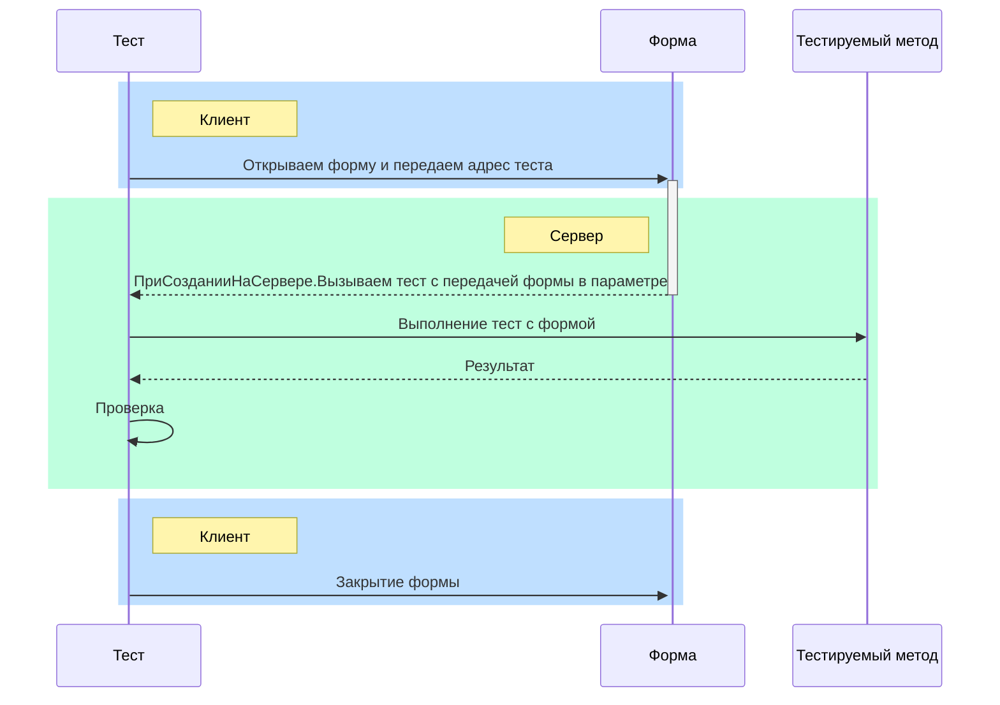

# Тестирование Серверных методов по работе с Формой

Иногда нам хочется протестировать серверный метод, который предназначен для работы с формой, например, добавление элементов на форму.  
Основная проблема в таком тесте, это получить форму на сервере, т.к. создать форму на сервере не получиться и с клиента ее нельзя передать.

Вот один из способов реализовать такой тест:
<details>
<summary>Код целиком</summary>

Тест:
```bsl
Процедура ДействияНадФормой(Форма = Неопределено) Экспорт
#Если Клиент Тогда
    ПараметрыФормы = Новый Структура("Метод", "yaxunit_ОбщегоНазначения.ДействияНадФормой(ЭтотОбъект)");
    Форма = ОткрытьФорму("ОбщаяФорма.НашаОбщаяФорма", ПараметрыФормы);
    Форма.Закрыть();
#Иначе
    Результат = НашТестируемыйМетод(Форма);
    ЮТест.ОжидаетЧто(Результат, "Создание декорации надпись")
        .Свойство("Вид").Равно(ВидДекорацииФормы.Надпись);
#КонецЕсли
КонецПроцедуры
```

Форма:
```bsl
&НаСервере
Процедура ПриСозданииНаСервере(Отказ, СтандартнаяОбработка)
    Выполнить(Параметры.Метод);
КонецПроцедуры
```
</details>

----

## Подготовка
1. Создаем клиент-серверный тестовый модуль
2. Регистрируем наш тестовый метод как **Клиентский тест**.

```bsl
Процедура ИсполняемыеСценарии() Экспорт
    
    ЮТТесты.ДобавитьКлиентскийТест("ДействияНадФормой");
КонецПроцедуры
```

2. Добавляем экспортный метод который будет реализовывать тест, в качестве входного параметра укажем **Форму**.

```bsl
Процедура ДействияНадФормой(Форма = Неопределено) Экспорт
КонецПроцедуры
```

3. Создаем в расширении **Общую форму** на которой мы будем проверять наш метод, в модуль формы добавляем обработчик события **ПриСозданииНаСервере**.

## Реализация

Работа нашего нашего теста будет состоять из 3-х шагов:


1. Сначала мы открываем форму и передаем в параметрах адрес нашего тестового метода.
2. В обработчике модуля формы **ПриСозданииНаСервере**  делаем обратный вызов нашего теста с передачей этой формы в качестве параметра.
3. Вызываем тестируемый метод с нашей формой и проверяем результат.

```bsl
Процедура ДействияНадФормой(Форма = Неопределено) Экспорт
#Если Клиент Тогда // Шаг 1
    // указываем путь к нашему тестовому методу в качестве параметра открытия формы
    ПараметрыФормы = Новый Структура("Метод", "yaxunit_ОбщегоНазначения.ДействияНадФормой(%1)");
    // открываем форму
    Форма = ОткрытьФорму("ОбщаяФорма.НашаОбщаяФорма", ПараметрыФормы);
    Форма.Закрыть();
#Иначе // Шаг 3
// в эту ветку мы попадаем уже после вызова тестового метода из обработчика модуля формы ПриСозданииНаСервере и имеем в своем распоряжении Форму
    // вызываем метод который мы хотим протестировать
    Результат = НашТестируемыйМетод(Форма);
    // Проверяем результат:
    // Допустим наш метод добавляет на форму Декорацию надпись и возвращает созданный элемент формы.
    ЮТест.ОжидаетЧто(Результат, "Создание декорации надпись")
        .Свойство("Вид").Равно(ВидДекорацииФормы.Надпись);
#КонецЕсли
КонецПроцедуры
```

В модуле формы в обработчике **ПриСозданииНаСервере** прописываем обратный вызов переданного в форму теста:
```bsl
&НаСервере
Процедура ПриСозданииНаСервере(Отказ, СтандартнаяОбработка)
    Выполнить(СтрШаблон(Параметры.Метод, ЭтотОбъект)); // Шаг 2
КонецПроцедуры
```