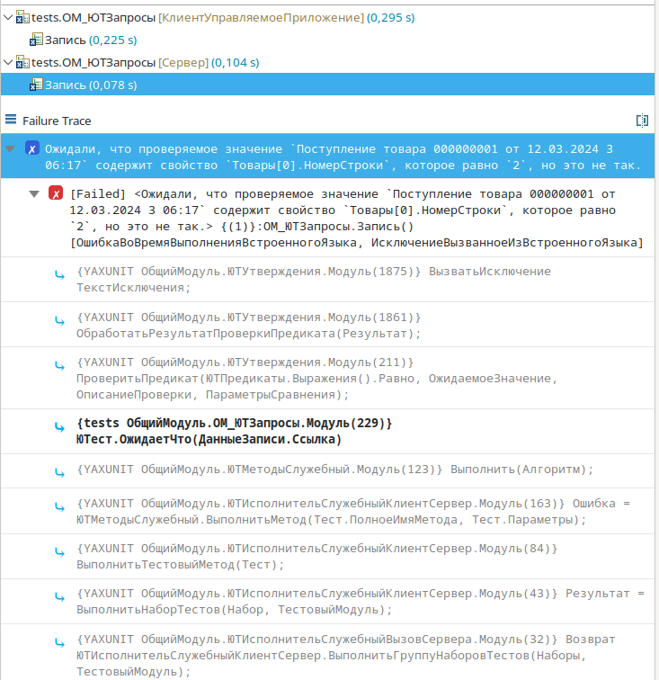

# Утверждения

Тестирование - это проверка системы на **соответствие требованиям**. Из этого следует, что при тестировании, у нас должны быть требования к тестируемой функциональности, сформулированные ожидания.  
Для описания ожиданий в тестах, использующих YAxUnit, применяется механизм утверждений, с помощью которых, разработчик описывает требования к тестируемому функционалу.

Утверждения позволяют, не только фиксировать ожидания, но и помогают формировать:

1. более читаемый и простой тест,
2. формируют "дружелюбные" и понятные сообщения об ошибках,
3. прививают единообразие у сокращают количество "велосипедов".

```bsl title="Пример утверждения"
ЮТест.ОжидаетЧто(ДанныеЗаписи)
    .Свойство("Поставщик").Равно(ДанныеОбъекта.Поставщик)
    .Свойство("Товары")
        .ИмеетДлину(1)
        .Свойство("Товары[0].НомерСтроки").Равно(2)
        .Свойство("Товары[0].Товар").Равно(ДанныеОбъекта.Товары[0].Товар);
```

В результате этой проверки (ошибочной) будет выброшено следующее исключение:

> Ожидали, что проверяемое значение `Поступление товара 000000001 от 12.03.2024 3:06:17` содержит свойство `Товары[0].НомерСтроки`, которое равно `2`, но это не так.

А так оно будет выглядеть в EDT.



## Зачем нужны утверждения YAxUnit

Основной задачей утверждений является формирование и проверка наши ожидания.  
Например, сложение 2 и 3 должно вернуть нам 5.  
Можно перефразировать это требование (ожидание) - тест ожидает, что `2 + 3` равно `5`.  
При помощи утверждений это превращается в следующий код - `ЮТест.ОжидаетЧто(2 + 3).Равно(5)`.

Вы можете проверить результат работы и без использования утверждений - `Если 2 + 3 <> 5 Тогда ВызватьИсключение "2 + 3 <> 5";КонецЕсли;`
Но отличии от ручной проверки с использованием условий и исключений утверждения дают ряд преимуществ:

* Всегда, ну или почти, понятные сообщения об ошибках, которые помогают локализовать причину.
* Также вам не надо ломать голову, что написать в исключении.
* Тесты получаются более читаемыми, цепочки вызовов формируют, что-то вроде предложений.
* Не все проверки столько просты как в примере, есть предикаты, сравнение таблиц, проверка вложенных свойств и данных в информационной базе
* Ошибки утверждений помечаются другим типов ошибки, это позволяет понять упал тест (не совпало ожидание) или наш код сломался.

В итоге: утверждений вещь полезная, изучите и используйте ее.

## Возможности

* Проверки [значений](assertions-base.md#доступные-методы)
* Проверки [методов объекта на выброс исключений](assertions-base.md#проверка-выполнения-метода)
* Проверки [данных информационной базы](assertions-db.md)

Это базовые методы проверки, с помощью которых вы можете проверить любое поведение (или почти любое) системы. На их основе вы можете сформировать библиотеку своих "бизнес" утверждений, заточенных под ваше решение, что облегчит вам разработку тестов.

:::tip Рекомендации

* Используйте отступы и форматирование для улучшения читаемости.
* Не забывайте указывать описания для проверок.
* Не стоит писать проверки ради проверок, проверяйте только то, что необходимо для кейса.
  Слишком большой код (цепочки утверждений в частности) сложно поддерживать, при необходимости разбейте его на блоки (методы).
:::
