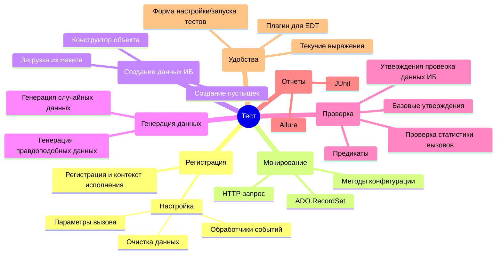

# Возможности YAxUnit



YAxUnit предоставляет относительно богатый набор инструментов для помощи разработчикам в написании тестов.

## Регистрация и настройка выполнения тестов

[Описание](test-registration.md), [API](/api/ЮТТесты)

Создание тестов начинается с регистрации их в движке, необходимо рассказать движку, какие имеются тесты, как их запускать, с какими параметрами.

Для этого используется обязательный предопределенный экспортный метод `ИсполняемыеСценарии`

```bsl
Процедура ИсполняемыеСценарии() Экспорт
    
    ЮТТесты.Добавить...

КонецПроцедуры
```

Подробнее смотрите в [описании](test-registration.md).

## Реализация тестов

Большая часть методов программного интерфейса YAxUnit собрана в модуле [ЮТест](/api/ЮТест). Этот модуль является точкой входа в API используемый в тестах, он предоставляет доступ к другим модулям движка:

* [`ЮТест.Данные()`](/api/ЮТТестовыеДанные) - Возвращает модуль работы с [тестовыми данными](test-data/)
* [`ЮТест.ОжидаетЧто()`](/api/ЮТУтверждения) - Возвращает модуль работы с [утверждениями](assertions/assertions-base.md)
* [`ЮТест.ОжидаетЧтоТаблицаБазы()`](/api/ЮТУтвержденияИБ)  - Возвращает модуль работы с [утверждениями для проверки объектов информационной базы](assertions/assertions-db.md)
* [`ЮТест.Контекст()`](/api/ЮТКонтекстТеста)  - Возвращает модуль работы с [контекстом](context.md)
* [`ЮТест.Предикат()`](/api/ЮТПредикаты)  - Возвращает конструктор [предикатов](predicates.md)
* [`ЮТест.Варианты()`](/api/ЮТКонструкторВариантов)  - Возвращает конструктор вариантов прогона теста.

### Создание тестовых данных

[Описание](test-data/), [API](/api/ЮТТестовыеДанные)

Почти все тесты опираются на данные, будь то параметры вызова или записи информационной базы. Вам придется эти данные создавать.  
Настоятельно рекомендую создавать данные программно, не загрузкой из макетов или вручную, а именно программно генерировать. О причинах можете почитать в [статье](test-data/) о тестовых данных

Движок предоставляет различные инструменты для создания данных:

* [`ЮТест.Данные().КонструкторОбъекта`](/api/ЮТТестовыеДанные#конструкторобъекта), с помощью которого вы можете создать объект информационной базы с необходимыми реквизитами.
* Создание пустышек - примитивных объектов с минимальным заполнения.
  * [`ЮТест.Данные().СоздатьЭлемент`](/api/ЮТТестовыеДанные#создатьэлемент)
  * [`ЮТест.Данные().СоздатьДокумент`](/api/ЮТТестовыеДанные#создатьдокумент)
  * [`ЮТест.Данные().СоздатьГруппу`](/api/ЮТТестовыеДанные#создатьгруппу)
* Возможна загрузка из макета. Вы можете создать все необходимые данные [загрузив их из макета](test-data/load-from-templates.md)
* Работа с временными файлами.
* [Подражатель](/api/ЮТПодражатель), для генерации правдоподобных данных.
* Генерация случайных значений.
* [`ЮТест.Данные().КонструкторОбъектаXDTO`](/api/ЮТТестовыеДанные#конструкторобъектаxdto), с помощью которого вы можете создать XDTO объект.

### Мокирование

[Описание](mocking), [API](/api/Мокито)

При тестировании полезно минимизировать "внешнее" воздействие на проверяемый функционал. Например, не использовать внешний http сервис, а эмулировать взаимодействие с ним, либо вместо выполнения запроса к базе данных вернуть предопределенный результат или вместо документа в качестве параметра передать структуру.  
Те заменить какой-либо объект обманкой, упрощенной его версией.

* [`Мокито`](mocking/mockito.md) позволяет настроить/изменить поведение нужных методов конфигурации
  * [`Вернуть`](/api/МокитоОбучение#вернуть) нужный результат для определенных параметров.
  * [`ВыброситьИсключение`](/api/МокитоОбучение#выброситьисключение) при в нужный момент.
  * [`Пропустить`](/api/МокитоОбучение#пропустить) метод (не выполнять).
  * Просто [`Наблюдать`](/api/МокитоОбучение#наблюдать) (собирать статистику вызовов) за методом.
  * За настройку условий срабатывания тех или иных действий отвечает метода [`Когда`](/api/МокитоОбучение#когда)
* [`ЮТест.Данные().HTTPСервисЗапрос()`](/api/ЮТТестовыеДанные#httpсервисзапрос) позволяет настроить и эмулировать входящий запрос http-сервиса.
  Если логика обработки запросов вынесена в отдельный общий модуль, то вы с легкостью с его помощью сможете протестировать ваш сервис без использования веб-сервера.
* [`ЮТест.Данные().ADORecordSet()`](/api/ЮТТестовыеДанные#adorecordset) позволяет протестировать "прямые" запросы к SQL.

### Проверка ожиданий

[Описание](assertions/)

* Проверка результата работы функции. Для проверки переменных (результатов методов) реализованы [базовые утверждения](assertions/assertions-base), подробнее со списком возможностей можете ознакомиться в [сгенерированном описании api](/api/ЮТУтверждения).
* Если метод должен изменить данны в информационной базе, то эти изменения можно проверить с помощью [утверждений ИБ](assertions/assertions-db), [описании api утверждений](/api/ЮТУтвержденияИБ).
* В некоторых случаях необходимо проанализировать какие методы и с какими параметрами вызывались. Здесь вам поможет [проверка статистики вызовов](/api/МокитоПроверки#вызовы), который собирает [Мокито](mocking)

### Методы-помощники

* Изменение данных в базе
  * [`ЮТест.Данные().УстановитьЗначениеРеквизита`](/api/ЮТТестовыеДанные#установитьзначениереквизита)
  * [`ЮТест.Данные().УстановитьЗначенияРеквизитов`](/api/ЮТТестовыеДанные#установитьзначенияреквизитов)
* [Предикаты](predicates.md)
* [Получение данных из базы и работа с запросами](auxiliary-modules/queries.md)
* Варианты вызова. Чтобы повысить покрытие метода тестом можно сформировать наборы (варианты) параметров вызова метода. Для упрощения работы с ними вы можете воспользоваться методом [`ЮТест.Варианты()`](/api/ЮТест#варианты)
* [`ЮТест.Пропустить`](/api/ЮТест#пропустить)
* [`ЮТест.Пауза`](/api/ЮТест#пауза)
* [`ЮТест.ВывестиВКонсоль`](/api/ЮТест#вывестивконсоль)

## Примеры

При возникновении трудностей с написанием тестов вы всегда можете

* Посмотреть примеры [тестов движка](https://github.com/bia-technologies/yaxunit/tree/develop/tests/src/CommonModules)
* Тесты других открытых проектов
  * [bellerage-ssl](https://github.com/Bellerage-IT/bellerage-ssl/tree/master/src/cfe/yaxunit/src/CommonModules)
