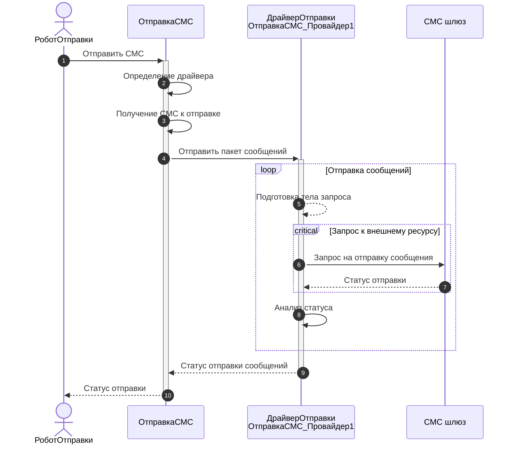

# Мокирование

## Вводная

Мокирование - это инструмент/подход для изоляции тестируемых частей кода и контроля над зависимостями.

При мокировании, мы вместо реальных (продуктовых) объектов подсовываем моки - подделки, фальшивки. Это "двойники" реальных объектов.

Например:

* Вместо, реального почтового сервера мы можем поднять в докере легковесный smtp сервер и настроить систему на взаимодействие с ним
* Используя SOAP UI/Postman/Wiremock или что-то другое мы сможем протестировать систему без использования реального сервиса
* Не редко вместо поднятия промышленной СУБД в тестах используются легковесные встраиваемые СУБД (sql lite, h2)

Все это относится к мокированию и позволяет упростить процесс поднятия окружения для тестов.

Но также моки могут быть использованы непосредственно при тестировании, например вместо реального документа в тестируемый метод вы можете передать структуру, содержащую все нужные реквизиты (Dummy, болванка), либо обработку с нужными методами (Мок), либо что-то иное, что позволяет вам упростить тест.
Например, при тестировании http-сервисов передаем мок, который "притворяется" запросом, реализует интерфейс объекта `HTTPСервисЗапрос`.

Основное ограничение такого подхода - обработки и структуры должны передаваться в качестве параметров в тестируемый метод. Если нам очень необходимо подменить объект, который вычисляется внутри метода, то приходится попотеть, либо передавать его в качестве доп. параметров и закладывать работы с ним в конфигурации, либо с помощью расширения возвращать жестко закодированное значение. Каждый раз, в таких случаях, приходится что-то изобретать и выдумывать способ внедрения моков.

## Мокито

Для унификации подхода к работе с моками мы разработали инструмент [Мокито](mockito.md), который облегчает тестирование.  
Он предоставляет

* подход к внедрению моков
* программный интерфейс для управления моками.

Например, у нас есть метод отправки СМС, через шлюз.



Он использует запросы к внешнему ресурсу, СМС шлюзу, который необходим в текущей схеме. Для решения этой проблемы мы можем:

1. Отправлять реальные СМС в тестах
2. Использовать тестовый шлюза, если провайдер предоставляет такую возможность
3. Поднять мокирующий web-server
4. Заложить в код обходы для тестирования
5. Воспользоваться Мокито, написав в тесте:

  ```bsl
    Ответ = Новый HTTPСервисОтвет(200);
    Ответ.УстановитьТелоИзСтроки(СериализацияJSON.ЗначениеВСтроку(Новый Структура("id, status",
                                                  "9999",
                                                  "delivered")));

    Мокито.Обучение(ОтправкаСМС_Провайдер1)
      .Когда("ПослатьСообщение") // Теперь, вместо реального запроса к шлюзу
        .Вернуть(Ответ)          // метод всегда будет возвращать нужный нам ответ
      .Прогон();

    РоботОтправки.ОтправкаСМС();
  ```
  
  В это случае, при отправке, не будут выполнятся запросы к шлюзу, вместо этого метод `ПослатьСообщение` вернет предопределенный результат.

Подробнее о возможностях и принципах работы с Мокито, вы можете почитать в отдельной [статье](mockito.md).

## Моки

Мокито помогает изменять логику работы системы для изоляции тестируемого метода и уменьшения влияния других компонентов системы.  
Он закрывает множество задач, но иногда возникают задачи когда даже он не может помочь.

### `HTTPСервисЗапрос`

Первый пример с которым мы столкнулись - тестирование http-сервисов. Сервис на вход принимает объект `HTTPСервисЗапрос`, который невозможно создать и настроить из кода 1С.  
Необходимо было либо публиковать решение на web-сервере, либо дорабатывать код, чтобы он принимал структуры.

Несколько первых тестов были созданы с помощью структур. Позже возникла идея реализовать мок, который бы походил на `HTTPСервисЗапрос`, реализовывал его интерфейс, и который можно настроить из теста.
С ним тестировать сервисы стало намного проще и удобнее, позже его включили в YAxUnit, [`ЮТест.Данные().HTTPСервисЗапрос`](/api/ЮТТестовыеДанные#httpсервисзапрос)

Возможности:

* Реализует методы `HTTPСервисЗапрос`
  * Свойства
    * `HTTPМетод` \ `HTTPMethod`
    * `БазовыйURL` \ `BaseURL`
    * `Заголовки` \ `Headers`
    * `ОтносительныйURL` \ `RelativeURL`
    * `ПараметрыURL` \ `URLParameters`
    * `ПараметрыЗапроса` \ `QueryOptions`
  * Методы
    * `ПолучитьТелоКакДвоичныеДанные()` \ `GetBodyAsBinaryData()`
    * `ПолучитьТелоКакПоток()` \ `GetBodyAsStream()`
    * `ПолучитьТелоКакСтроку()` \ `GetBodyAsString()`
* Имеет методы настройки, реализованные в виде [текучих выражений](/docs/getting-started/fluent-api.md)
  * Установка тела
    * `УстановитьТелоКакДвоичныеДанные()`
    * `УстановитьТелоКакСтроку()`
    * `УстановитьТелоКакСтрокуJSON()`
  * Методы установки свойств
    * `ДобавитьЗаголовок()`
    * `ДобавитьПараметрЗапроса()`
    * `ДобавитьПараметрURL()`
    * `Метод()`
    * `БазовыйURL()`
    * `ОтносительныйURL()`

### `ADO.RecordSet`

При тестировании прямых запросов к СУБД также возникает потребность использовать мок, для эмуляции чтения из `ADO.RecordSet`.

Для таких кейсов был добавлен [`ЮТест.Данные().ADORecordSet`](/api/ЮТТестовыеДанные#adorecordset) реализующий интерфейс `ADO.RecordSet`

* Свойства
  * `EOF`
  * `BOF`
  * `AbsolutePosition`
  * `RecordCount`
  * `Fields`
* Методы
  * `MoveFirst()`
  * `MoveNext()`
  * `Close()`
  * `Fields()`
  * `EOF()`
  * `BOF()`
* Методы настройки, реализованные в виде [текучих выражений](/docs/getting-started/fluent-api.md)
  * `ЮТест.Данные().ADORecordSet` - принимает информацию о колонках
  * `Добавить()` - добавляет новую строку значений

### Создание своих моков

При возникновении подобных ситуаций, когда для тестов вам нужны объекты с какой-то логикой/методами, по аналогии с примерами выше вы без проблем сможете создать нужные вам моки.

Это очень сильно облегчает тестирование и позволяет вам избежать лишнего вмешательства в тестируемый код.
