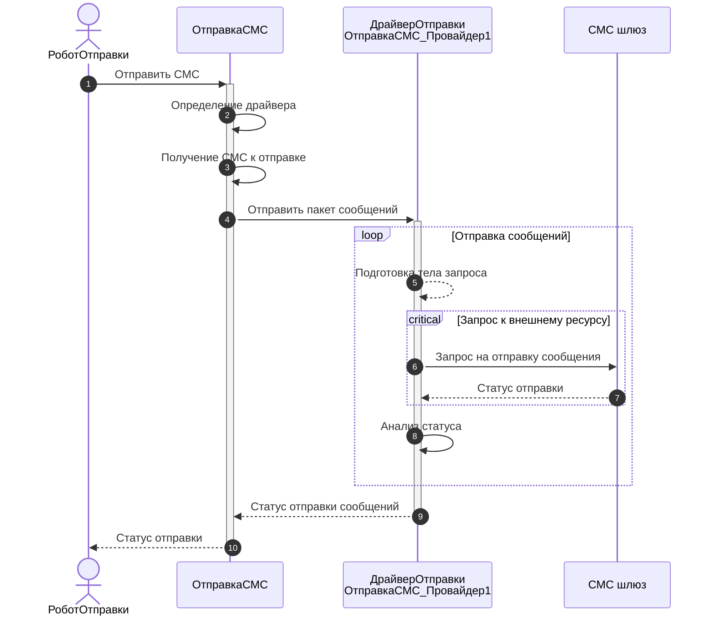

# Мокирование

## Вводная

Мокирование — это мощный подход, используемый в разработке программного обеспечения для изоляции тестируемых компонентов и управления их зависимостями. Вместо работы с реальными объектами, которые могут быть сложными в настройке или требовать внешних ресурсов, разработчики используют моки — специальные "двойники", имитирующие поведение реальных объектов. Это позволяет упростить процесс тестирования, сделать его более предсказуемым и независимым от внешних факторов.

Мокирование может применяться на разных уровнях: от замены внешних сервисов (например, почтовых серверов или баз данных) до создания упрощенных объектов (например, "болванок" или заглушек) для передачи в тестируемые методы. Например, вместо реального SMTP-сервера можно использовать легковесный аналог, а вместо промышленной СУБД — встраиваемую базу данных, такую как SQLite или H2. Это не только ускоряет процесс тестирования, но и снижает затраты на поддержку тестового окружения.

В этой статье мы рассмотрим основные принципы мокирования, его преимущества и ограничения, а также практические примеры использования моков в различных сценариях тестирования.

## Примеры применимости

Вот несколько примеров, где мокирование может быть применено в 1С:

### 1. Тестирование интеграций с внешними системами

В 1С часто требуется взаимодействие с внешними сервисами, такими как REST/SOAP API, почтовые серверы или системы электронного документооборота. Вместо реальных вызовов внешних сервисов можно использовать моки, чтобы имитировать их поведение.

**Пример:**

Вместо реального вызова API стороннего сервиса (например, получения курсов валют) можно создать мок, который возвращает заранее подготовленные данные. Это позволяет тестировать логику обработки данных без зависимости от доступности внешнего сервиса.

```bsl
// При запросе курса доллара вернет 27
Мокито.Обучение(ПровайдерКурсовВалют)
  .Когда(ПровайдерКурсовВалют.ПолучитьКурс(840))
    .Вернуть(27)
  .Прогон();
```

### 2. Тестирование работы с базой данных

В часто требуется тестировать логику, которая взаимодействует с базой данных. Вместо использования реальных данных из базы можно использовать моки для имитации данных.

**Пример:**

Вместо выполнения запросов к базе данных можно создать мок, который возвращает фиктивные данные. Например, для тестирования обработки, которая работает с документами "Реализация", можно создать мок, возвращающий заранее подготовленный набор документов.

```bsl
Реализация1 = ДанныеТестовойРеализации(Контрагент1, 1000); // Вернет структуру с набором реквизитов реализации
Реализация2 = ДанныеТестовойРеализации(Контрагент2, 2000); // Вернет структуру с набором реквизитов реализации

Обработка.ОбработатьРеализации(ЮТКоллекции.ЗначениеВМассиве(Реализация1, Реализация2));
```

### 3. Тестирование сложной бизнес-логики

Не редко встречается сложная бизнес-логика, которая зависит от множества факторов. Мокирование позволяет изолировать тестируемую логику от зависимостей.

Пример:

При тестировании расчета скидок для клиентов можно создать мок, который возвращает фиктивные данные о клиенте (например, категорию клиента, историю покупок). Это позволяет проверить корректность расчета скидок без необходимости создания реальных данных в базе.

```bsl
ДанныеКлиента = Новый Структура("Категория, ИсторияПокупок", "VIP", Новый Массив);
ДанныеКлиента.ИсторияПокупок.Добавить(Новый Структура("Дата, Сумма", '311212000', 2500));
ДанныеКлиента.ИсторияПокупок.Добавить(Новый Структура("Дата, Сумма", '01012001', 12500));

Мокито.Обучение(РасчетСкидок)
  .Когда("ДанныеКлиента")
    .Вернуть(ДанныеКлиента)
  .Прогон();
```

Мокирование в 1С позволяет упростить тестирование, изолировать тестируемые компоненты и сделать процесс тестирования **более предсказуемым**. Оно особенно полезно при работе с внешними системами, базой данных, сложной бизнес-логикой и оборудованием. Использование моков помогает сосредоточиться на тестируемой логике, минимизируя влияние внешних факторов.

:::tip Кратко
Мокирование — это подход, при котором реальные объекты заменяются их **фиктивными двойниками**, такими как структуры, таблицы значений, объекты конфигурации, созданные в памяти, или специализированные обработки-эмуляторы.
Это позволяет изолировать тестируемый код, упрощают проверку различных сценариев и снижают зависимость от внешних ресурсов, делая процесс тестирования более гибким и предсказуемым.
:::

В реальности использование моков сопряжено с некоторыми сложностями. Они легко применимы, когда зависимости передаются в метод явно, например, через параметры. Однако если объект создается внутри метода, внедрение мока может потребовать дополнительных усилий, таких как рефакторинг кода или применение специализированных инструментов.

## Мокито

Для решения этой проблемы, а также для упрощения работы с моками и унификации подхода к тестированию, был разработан инструмент **[Мокито](mockito/mockito.md)**. Он предоставляет:

* единый подход к внедрению моков;
* программный интерфейс для управления их поведением.

Рассмотрим пример: метод отправки СМС через шлюз, который использует запросы к внешнему ресурсу (СМС-шлюзу). Это создает сложности при тестировании, так как требует взаимодействия с внешней системой.



Для решения этой проблемы можно:

1. Отправлять реальные СМС в тестах.
2. Использовать тестовый шлюз, если провайдер предоставляет такую возможность.
3. Поднять мокирующий веб-сервер.
4. Добавить в код обходы для тестирования.
5. Воспользоваться **Мокито**, написав в тесте:

  ```bsl
    Ответ = Новый HTTPСервисОтвет(200);
    Ответ.УстановитьТелоИзСтроки(СериализацияJSON.ЗначениеВСтроку(Новый Структура("id, status",
                                                  "9999",
                                                  "delivered")));

    Мокито.Обучение(ОтправкаСМС_Провайдер1)
      .Когда("ПослатьСообщение") // Теперь, вместо реального запроса к шлюзу
        .Вернуть(Ответ)          // метод всегда будет возвращать нужный нам ответ
      .Прогон();

    РоботОтправки.ОтправкаСМС();
  ```
  
  В этом случае запросы к шлюзу выполняться не будут, а метод `ПослатьСообщение` вернет заранее заданный результат.

Подробнее о возможностях и принципах работы с **Мокито** вы можете узнать в отдельной [статье](mockito/mockito.md).

## Заглушки (stubs)

`Мокито` помогает изменять логику работы системы для изоляции тестируемого метода и минимизации влияния других компонентов.  
Он решает множество задач, но в некоторых случаях он может быть недостаточным. Для таких ситуаций предусмотрены специализированные заглушки:

* **[`HTTPСервисЗапрос`](stubs/http-service-request.md)** — для тестирования HTTP-сервисов в 1С.
* **[`HTTPОтвет`](stubs/http-response.md)** и **[`HTTPСоединение`](stubs/http-connection.md)** — для тестирования запросов к внешним сервисам.
* **[`СообщениеСервисаИнтеграции`](stubs/integration-service-message.md)** — для тестирования интеграций с помощью 1С:Шина.
* **[`ADO.RecordSet`](stubs/ado-recordset.md)** — для тестирования прямых запросов к СУБД.

### Создание своих заглушек

Если в ваших тестах требуются объекты с определенной логикой или методами, вы можете создавать собственные заглушки по аналогии с приведенными примерами. Это позволяет:

* Упростить тестирование, избегая сложных зависимостей.
* Минимизировать вмешательство в тестируемый код.
* Обеспечить гибкость и контроль над тестовыми сценариями.