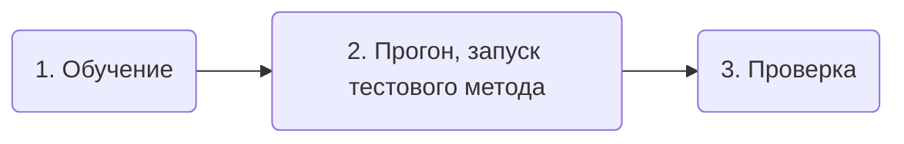
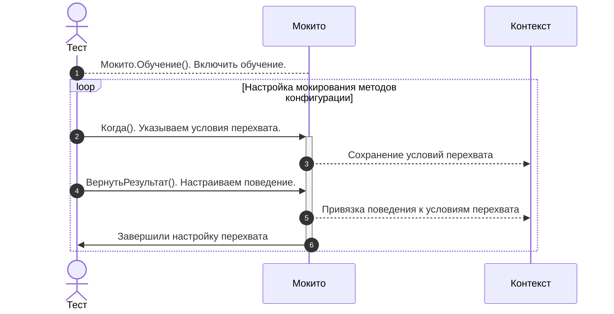
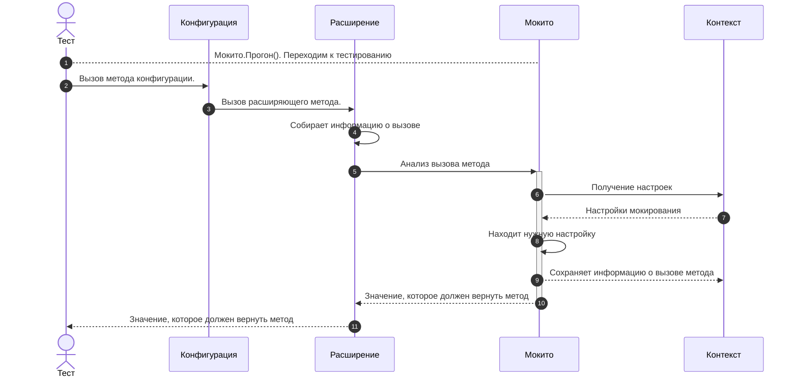

# Мокито

[Мокито](/api/Мокито) - модуль созданный по образу популярного java-фреймворка для тестирования [Mockito](https://site.mockito.org/). Расширяет возможности тестирования, позволяет легко менять логику работы системы подменяя результаты работы методов, отключая какие-либо алгоритмы и проверки.

## Возможности

С помощью Мокито мы можем с легкостью управлять поведением системы прямо из теста, для этого есть возможность:

* Настраивать какие методы "меняют" свое поведение, а какие обрабатывают "как положено".
* Для разных тестов или кейсов внутри теста можно перенастраивать поведение методов.
* Задавать условия на параметры метода.
* Мокировать как экспортные так и приватные методы, процедуры и функции.
* Настраивать разные "реакции" на вызов метода:
  * Вернуть указанный результат
  * Вызвать исключение
  * Не выполнять метода
  * Просто наблюдать за методом (собирать статистику по вызовам)

Вы можете мокировать почти любой метод конфигурации, **исключение** - методы глобального контекста.

1. Методы общих модулей
2. Методы менеджеров
3. Методы конкретных объектов, будь то документы или справочники

Примеры:

* Для всех объектов определенного типа - обучаете через менеджер
  ```bsl
  Мокито.Обучение(Документы.ПриходТовара) // Для всех документов ПриходТовара
    .Когда("ОбработкаПроведения")
  ```
* Если нужно мокировать метод экземпляра объекта, то указываем его при обучении
  ```bsl
  Мокито.Обучение(ДокументОбъект) // Для конкретного экземпляра объекта, 
    .Когда("ОбработкаПроведения") // другой документ объект, даже полученный из той же ссылки отработает без мокирования
  ```
* либо ссылку на этот объект
  ```bsl
  Мокито.Обучение(ДокументСсылка) // Любой документ объект с той же ссылкой
    .Когда("ОбработкаПроведения")
  ```
* Можно мокировать методы обработок и отчетов
  ```bsl
  Мокито.Обучение(Отчеты.ОСВ) // Для всех отчетов
    .Когда("СформироватьОтчет")
  
  Отчет = Отчеты.ОСВ.СоздатьОтчет();
  Мокито.Обучение(Отчет) // для конкретного экземпляра отчета
    .Когда("СформироватьОтчет")
  ```

Мокито не может:

* Выполнять произвольную логику при вызове - выполнить алгоритм или вызвать какой-либо другой метод.
* Не может изменять параметры.
* При сборе статистики не хранит результат.

## Принцип работы

Мокито базируется на двух вещах:

* Расширения и заимствование методов, благодаря им появилась возможность менять поведение системы.
* Глобальный контекст, доступный как из теста, так и из заимствованных методов конфигурации.

### Настройка мокируемых методов

Для того чтобы вы смогли мокировать метода, вам в первую очередь необходимо добавить его в свое расширение.

И добавить реализацию по шаблону для функции:

```bsl
&Вместо("<ИмяМокируемогоМетода>")
Функция Мок_<ИмяМокируемогоМетода>(<ПараметрыМетода>)
  ПараметрыМетода = Мокито.МассивПараметров(<ПараметрыМетода>);
  ПрерватьВыполнение = Ложь;

  Результат = МокитоПерехват.АнализВызова(<МокируемыйОбъект>, "<ИмяМокируемогоМетода>", ПараметрыМетода, ПрерватьВыполнение);

  Если Не ПрерватьВыполнение Тогда
    Возврат ПродолжитьВызов(<ПараметрыМетода>);
  Иначе
    Возврат Результат;
  КонецЕсли;
КонецФункции
```

Либо для процедуры:

```bsl
&Вместо("<ИмяМокируемогоМетода>")
Процедура Мок_<ИмяМокируемогоМетода>(<ПараметрыМетода>)
  ПараметрыМетода = Мокито.МассивПараметров(<ПараметрыМетода>);
  ПрерватьВыполнение = Ложь;

  МокитоПерехват.АнализВызова(<МокируемыйОбъект>, "<ИмяМокируемогоМетода>", ПараметрыМетода, ПрерватьВыполнение);

  Если Не ПрерватьВыполнение Тогда
    ПродолжитьВызов(<ПараметрыМетода>);
  КонецЕсли;
КонецПроцедуры
```

:::tip
Если метод не содержит параметров можно использовать пустой массив:

```bsl
ПараметрыМетода = Новый Массив;
```

:::

Если вы используете 1С:Enterprise Development Tools (EDT), то можете воспользоваться контекстной командой `1С:Модульные тесты (YAxUnit)` -> `Создать/обновить мок для...`


Примеры добавления методов в расширение.

#### Метод общего модуля

Добавляем обработку метода `ПолучитьПрофиль` общего модуля `РаботаСПочтой`

```bsl title="tests\ОбщиеМодули\РаботаСПочтой\Модуль.bsl"
&Вместо("ПолучитьПрофиль")
Функция Мок_ПолучитьПрофиль(ИмяОтправителя, ИспользоватьIMAP) Экспорт
    // Собираем параметры в массив
    ПараметрыМетода = Мокито.МассивПараметров(ИмяОтправителя, ИспользоватьIMAP);

    // Отправляем данные на анализ
    ПрерватьВыполнение = Ложь;
    Результат = МокитоПерехват.АнализВызова(РаботаСПочтой, "ПолучитьПрофиль", ПараметрыМетода, ПрерватьВыполнение);

    // Обрабатываем результат анализа
    Если НЕ ПрерватьВыполнение Тогда
        Возврат ПродолжитьВызов(ИмяОтправителя, ИспользоватьIMAP);
    Иначе
        Возврат Результат;
    КонецЕсли;
КонецФункции
```

#### Метод модуля менеджера

Подходит для любого модуля менеджера, будь то, документ, регистр или отчет.

Добавляем обработку метода `НовыйИдентификаторПодписчикаУведомлений` модуля менеджера справочника `Справочники.МобильныеУстройства`

```bsl title="tests\Справочники\МобильныеУстройства\МодульМенеджера.bsl"
&Вместо("НовыйИдентификаторПодписчикаУведомлений")
Процедура Мок_НовыйИдентификаторПодписчикаУведомлений(Подписчик, Идентификатор) Экспорт

    // Собираем параметры в массив
    ПараметрыМетода = Мокито.МассивПараметров(Подписчик, Идентификатор);

    // Отправляем данные на анализ
    ПрерватьВыполнение = Ложь;
    МокитоПерехват.АнализВызова(Справочники.МобильныеУстройства, "НовыйИдентификаторПодписчикаУведомлений", ПараметрыМетода, ПрерватьВыполнение);

    // Обрабатываем результат анализа
    Если НЕ ПрерватьВыполнение Тогда
        ПродолжитьВызов(Подписчик, Идентификатор);
    КонецЕсли;

КонецПроцедуры
```

#### Метод модуля объекта

Добавляем обработку приватного метода `ОбработкаПроведения` модуля объекта справочника `Документ.ПриходТовара`

```bsl title="tests\Документы\ПриходТовара\МодульОбъекта.bsl"
&Вместо("ОбработкаПроведения")
Процедура Мок_ОбработкаПроведения(Отказ, Режим)

    // Собираем параметры в массив
    ПараметрыМетода = Мокито.МассивПараметров(Отказ, Режим);

    // Отправляем данные на анализ
    ПрерватьВыполнение = Ложь;
    МокитоПерехват.АнализВызова(ЭтотОбъект, "ОбработкаПроведения", ПараметрыМетода, ПрерватьВыполнение);

    // Обрабатываем результат анализа
    Если НЕ ПрерватьВыполнение Тогда
        ПродолжитьВызов(Отказ, Режим);
    КонецЕсли;

КонецПроцедуры
```

После этого, вы может управлять поведение метода из ваших тестов.

Тестирование с использованием Мокито можно разделить на 3 стадии:



1. Сначала вы проводите **обучение** - настраиваете, какие методы мокируем и как они должны себя вести.
2. Потом выполняете тестовый **прогон** целевого метода.
3. После вам может понадобиться **проверка** вызовов, были ли вызваны нужные метода, с какими параметрами.

```bsl
  // Подготовка
  Ответ = Новый HTTPСервисОтвет(1);
  Ответ.УстановитьТелоИзСтроки(СериализацияJSON.ЗначениеВСтроку(Новый Структура("id, status",
                                                "9999",
                                                "delivered")));
  
  // Обучение мокито
  Мокито.Обучение(ОтправкаСМС_Провайдер1)
    .Когда("УстановитьСоединение").Вернуть(Истина)
    .Когда("ПослатьСообщение").Вернуть(Ответ)
    .Прогон();
  
  // Тестовый прогон
  РоботОтправки.ОтправкаСМС();

  // Проверка статистики
  Мокито.Проверить(ОтправкаСМС_Провайдер1)
    .КоличествоВызовов("ПослатьСообщение")
    .Равно(1);
```

Подробнее расскажу по каждой стадии

### Обучение

Обучение - это процесс настройки мокито. Вы указываете какие методы и при каких условиях (параметрах) должны изменить свое поведение.

С помощью API вы можете:

* [`Наблюдать()`](/api/МокитоОбучение#наблюдать) - просто наблюдать за методом, собирать статистику.
* [`Когда()`](/api/МокитоОбучение#когда) - указать какой метод и с каким параметрами необходимо обрабатывать.
* [`Вернуть()`](/api/МокитоОбучение#вернуть) - настроить, чтобы метод возвращал нужный результат.
* [`ВыброситьИсключение()`](/api/МокитоОбучение#выброситьисключение) - настроить, чтобы метод выбрасывал исключение.
* [`Пропустить()`](/api/МокитоОбучение#пропустить) - настроить, чтобы метод был пропущен, не выполнился.
* [`ВыполнитьМетод()`](/api/МокитоОбучение#выполнитьметод) - настроить, чтобы метод выполнился как есть.

```bsl
Мокито.Обучение(ОтправкаСМС_Провайдер1)
    .Когда("УстановитьСоединение").Пропустить()
    .Когда("ПослатьСообщение").Вернуть(Ответ)
    .Наблюдать("ОбработатьОтвет")
```

Подробнее о методах ниже, а сейчас для лучшего понимания расскажу как работает обучение.  
Используя методы API вы формируете настройки `Мокито`, которые при вызове каждого метода обучения изменяются и сохраняются в [глобальном контексте](../context.md) движка. Каждый метод просто сохраняет нужным образом параметры в глобальные структуру.



:::caution Сброс старых настроек
Каждый вызов метода `Мокито.Обучение`, по умолчанию, очищает предыдущие настройки по указанному объекту. Это нужно учитывать когда вы доучиваете Мокито в тесте.  
Если вам не нужно сбрасывать старые настройки по объекту передайте соответствующий параметр

```bsl
Мокито.Обучение(ОтправкаСМС_Провайдер1)
    .Когда("УстановитьСоединение").Пропустить()
    .Когда("ПослатьСообщение").Вернуть(Ответ)
    .Наблюдать("ОбработатьОтвет")
    .Прогон();
// Какая то логика

Мокито.Обучение(ОтправкаСМС_Провайдер1, Ложь) // Дообучение
    .Когда("ПослатьСообщение").Вернуть(Ответ2);
```

:::

В процессе обучения мы создаем правила, описывающие как будет вести себя метод при различных вариантах вызова.
Правила состоят из двух частей

* условие срабатывания (об/ект, метод, параметры), задаются в методе `Когда` или `Наблюдать`
* действие выполняемое при соблюдении условий - `Вернуть`, `ВыброситьИсключение`, `Пропустить`, `ВыполнитьМетод`

#### Условия

Условие состоит из трех частей

* Объект, которому относится метод
* Имя метода
* Параметры метода

##### Объект

Объект является обязательным и задается в методе [`Мокито.Обучение()`](/api/Мокито#обучение).

В качестве объекта могут выступать:

* **Менеджер объекта метаданных**, в таком случае под условие попадают все обращения к этому типу метаданных, будь вызовы методов модуля менеджера или объекта.
* **Ссылка**, под условие попадают все обращения к объектам имеющим ту же ссылку.
* **Объект** - конкретный объект метаданных (документ, обработка, набор записей), только обращения к методам этого экземпляра объекта.

##### Имя метода

Имя метода, является обязательным. Указывается в методах `Когда` или `Наблюдать`.
Можно обрабатывать и экспортные и приватные метода, главное чтобы для него была [выполнена настройка](#настройка-мокируемых-методов)

##### Параметры

Указывается в методах `Когда` или `Наблюдать`, передачей массива ожидаемых параметров.

Необязательная часть условия, если не указывать, но будут обрабатывать все вызовы.  
Также необязательно указывать все параметры метода, достаточно указать только первую часть.

В качестве параметров можно указывать:

* Конкретные значения параметров
* Маски
  * [`Мокито.ЛюбойПараметр()`](/api/Мокито#любойпараметр) - параметр может принимать любое значение
  * [`Мокито.СтроковыйПараметр()`](/api/Мокито#строковыйпараметр) - параметр может принимать только строковые значения
  * [`Мокито.ЧисловойПараметр()`](/api/Мокито#числовойпараметр) - параметр может принимать только числовые значения
  * [`Мокито.ТипизированныйПараметр()`](/api/Мокито#типизированныйпараметр) - параметр может принимать значения указанного типа
* Предикаты, параметр должен соответствовать заданным условиям.
  ```bsl
   Мокито.Обучение(РаботаСHTTP)
    .Когда(РаботаСHTTP.ОтправитьОбъектНаСервер(ИсточникДанных, ЮТест.Предикат().НеИмеетСвойства("Авторизация")))
    .Вернуть(ОтветНеобходимаАвторизация())
  ```

##### Варианты обучения (формирования условий)

Существует 2 основных подхода к формированию условий вызова:

1. Явный вызов метода с параметрами
   ```bsl
   Мокито.Обучение(РаботаСHTTP)
    .Когда(РаботаСHTTP.ОтправитьОбъектНаСервер(ИсточникДанных, Данные))
    .Вернуть(2)
   ```
2. Указание имени метода и набора параметров
   ```bsl
   Мокито.Обучение(РаботаСHTTP)
    .Когда("ОтправитьОбъектНаСервер", Мокито.МассивПараметров(ИсточникДанных, Данные))
    .Вернуть(2)
   ```

Первый вариант имеет ряд недостатков:

1. Работает только для экспортных методов
2. Необходимо передавать все обязательные параметры или использовать для них маску `Мокито.ЛюбойПараметр()`
3. Если не указывать необязательные параметры, то их значения по умолчанию попадут в настройку. Покажу на примере.
   ```bsl
   // Имеется метод 
   Функция Метод(Параметр1, Параметр2, Параметр3 = 3) Экспорт
    Возврат Параметр1 + Параметр2 + Параметр3;
   КонецФункции

   Мокито.Обучение(...)
    .Когда(Метод(1, 2))
    .Вернуть(0)
    .Прогон();
   
   Метод(1, 2);    // Вернет 0
   Метод(1, 2, 3); // Вернут 0
   Метод(1, 2, 4); // Вернут 7, будет выполнен основной алгоритм

   // Второй вариант обучения
   Мокито.Обучение(...)
    .Когда("Метод",  Мокито.МассивПараметров(1, 2))
    .Вернуть(0)
    .Прогон();
   
   Метод(1, 2);    // Вернет 0
   Метод(1, 2, 3); // Вернут 0
   Метод(1, 2, 4); // Вернут 0
   ```

#### Действия (Реакции)

После того как определились с условием вызова указанным в методе `Когда` нужно указать реакцию (действие). Возможные реакции:

* [`Вернуть`](/api/МокитоОбучение#вернуть) - вернуть указанное значение
* [`ВыброситьИсключение`](/api/МокитоОбучение#выброситьисключение) - вызвать исключение с переданным текстом
* [`Пропустить`](/api/МокитоОбучение#пропустить) - пропустить выполнение метод (актуально для процедур)
* [`ВыполнитьМетод`](/api/МокитоОбучение#выполнитьметод) - выполнить основной метод конфигурации, обычно комбинируется к другими реакциями, чтобы задать исключение.  
  Предположим, по умолчанию метод должен выбрасывать исключение, но для одного конкретного случая должен выполниться реальный метод конфигурации. Это проще всего сделать следующим образом:  
  ```bsl
  Мокито.Обучение(...)
    // По умолчанию метод падает
    .Когда("МегаФункция").ВыброситьИсключение("Упал")
    // При вызове с параметрами `1, 2, 3` выполняется метод конфигурации
    .Когда("МегаФункция", Мокито.МассивПараметров(1, 2, 3)).ВыполнитьМетод()
  ```

```bsl title="Пример мокирования методов документа"
Документ = СоздатьДокумент();

Мокито.Обучение(Документ)
  .Когда("ОбработкаПроверкиЗаполнения").Пропустить() // Отключим проверку заполнения документа
  .Когда("КонтрольОстатков").Вернуть(Истина)         // Проверка остатков будет успешной
  .Когда("ЗафиксироватьОшибки").ВыброситьИсключение("Не должно быть ошибок") // При вызове "лишнего" кода сразу валим тест
  .Когда("СформироватьПроводки") 
    .Пропустить()                                    // Отключаем формирование таблицы движений
  .Когда("СформироватьПроводки", Мокито.МассивПараметров("Взаиморасчеты"))
    .ВыполнитьМетод()                                // Но включаем для регистра "Взаиморасчеты"
  .Прогон();                                         // Завершаем настройку

Документ.Записать(РежимЗаписиДокумента.Проведение);
```

##### Цепочки действий

В дополнение к условиям можно формировать цепочки действий, которые будут выполнятся в порядке их "регистрации".
Например, есть метод без параметров, для которого необходимо сэмулировать ситуацию когда он возвращает разные значения.

```bsl

Мокито.Обучение(...)
  .Когда("БытьИлиНеБыть")
    .Вернуть("Быть")            // Первый вызов метода вернет "Быть"
    .Вернуть("Или")             // Второй вызов
    .Вернуть("НеБыть")          // Третий
    .ВыброситьИсключение("Конец") // Четвертый и все последующие
```

#### Примеры формирования различных вариантов условий

```bsl title="Имеется метод:"
Функция ОтправитьОбъектНаСервер(ИсточникДанных, Объект, HTTPМетод = "POST",
        ТипКонтента = "json", Преобразование = Неопределено,
        ДопНастройки = Неопределено, Ответ = Неопределено, ОтветВСтруктуру = Ложь,
        ТелоОтветаВХранилище = Ложь) Экспорт
```

Предположим необходимо:

* Переопределить все вызовы метода - указываем имя метода без указания параметров  
  ```bsl
  Мокито.Обучение(РаботаСHTTP)
    .Когда("ОтправитьОбъектНаСервер").Вернуть(1)
  ```
* Переопределить вызов, когда первый параметр имеет определенное значение
  ```bsl
  Мокито.Обучение(РаботаСHTTP)
    .Когда("ОтправитьОбъектНаСервер", Мокито.МассивПараметров(ИсточникДанных))
    .Вернуть(2);
  
  // Через явный вызов метода
  Мокито.Обучение(РаботаСHTTP)
    .Когда(РаботаСHTTP.ОтправитьОбъектНаСервер(ИсточникДанных, Мокито.ЛюбойПараметр())
    .Вернуть(2) // Тут используется маска `Мокито.ЛюбойПараметр()`, тк второй параметр является обязательным
  ```
* Переопределить вызов, когда **второй** параметр имеет определенное значение
  ```bsl
  Мокито.Обучение(РаботаСHTTP)
    .Когда("ОтправитьОбъектНаСервер", Мокито.МассивПараметров(Мокито.ЛюбойПараметр(), Объект))
    .Вернуть(2);

  // Через явный вызов метода
  Мокито.Обучение(РаботаСHTTP)
    .Когда(РаботаСHTTP.ОтправитьОбъектНаСервер(Мокито.ЛюбойПараметр(), Объект)
    .Вернуть(2)
  ```
* Условие на тип параметра
  ```bsl
  // Первый параметр должен быть ссылкой на справочник, второй числом
  Мокито.Обучение(РаботаСHTTP)
    .Когда("ОтправитьОбъектНаСервер", Мокито.МассивПараметров(Мокито.ТипизированныйПараметр(Тип("СправочникСсылка.ИсточникиДанных")), Мокито.ЧисловойПараметр()))
    .Вернуть(3);
  
  // Через явный вызов метода
  Мокито.Обучение(РаботаСHTTP)
    .Когда(РаботаСHTTP.ОтправитьОбъектНаСервер(Мокито.ТипизированныйПараметр(Тип("СправочникСсылка.ИсточникиДанных")), Мокито.ЧисловойПараметр()))
    .Вернуть(3);
  ```
* На основании порядка вызовов метода
  ```bsl
  Мокито.Обучение(РаботаСHTTP)
    .Когда("ОтправитьОбъектНаСервер")
    .Вернуть(1)
    .Вернуть(2)
    .Вернуть(3)
    .ВыброситьИсключение("Конец");
  ```

### Тестовый прогон

После обучения, настройки реакций на вызовы методов, можно запускать тест нужного метода.  
Но перед этим необхдимо перевести `Мокито` в режим **прогона тестов**, для этого используется метод [`Мокито.Прогон()`](/api/Мокито#прогон).  

Метод `Прогон` завершает настройку и изменяет режим работы, после этого все вызовы к настроенным методам (добавленным в расширение) будут перехватываться и анализироваться на совпадение условий вызова.

:::info
Также метод `Прогон` очищает накопленную статистику прошлых прогонов. Если вам необходимо ее сохранить передайте `Ложь` в параметрах.
:::

* Для методов, которые были указаны в `Когда()` или `Наблюдать()`, будет собираться статистика вызовов.
* Для методов, у которых есть подходящая "реакция" будет переопределено выполнение и запустится соответствующая реакция (вернуть значение, вызвать исключение и тд)
* Для прочих методов (не настроенных) логика не изменится.

```bsl
// Настройка
Мокито.Обучение(РаботаСHTTP)
    .Когда("ОтправитьОбъектНаСервер", Мокито.МассивПараметров(Мокито.ЛюбойПараметр(), Мокито.ЛюбойПараметр()))
    .Вернуть(РезультатПоУмолчанию)
    .Когда("ОтправитьОбъектНаСервер", Мокито.МассивПараметров(Справочники.ИсточникиДанных.FTP, 2))
    .Вернуть(2)
    .Прогон(); // Перевод в режим прогона теста

Результат = РаботаСHTTP.ОтправитьОбъектНаСервер(ИсточникДанных, Данные); // Результат будет равен переменной РезультатПоУмолчанию
Результат = РаботаСHTTP.ОтправитьОбъектНаСервер(Справочники.ИсточникиДанных.FTP, 2); // Результат будет равен 2
```

Схема вызовов при вызове замокированного метода.



### Проверка

После прогона теста можно проверить какие методы, с какими параметрами вызывались. Для этих целей необходимо воспользоваться методом [`Мокито.Проверить`](/api/Мокито#проверить)

```bsl
ЛюбойПараметр = Мокито.ЛюбойПараметр();

Мокито.Проверить(РаботаСHTTP) // Устанавливаем проверяемый объект
    // Проверка общего количества обращений к методу
    .КоличествоВызовов("ОтправитьОбъектНаСервер")
      .Заполнено()
    .КоличествоВызовов(РаботаСHTTP.ОтправитьОбъектНаСервер(ЛюбойПараметр, ЛюбойПараметр))
      .Равно(3)
    // Проверка обращений с фильтром по типам параметров
    .КоличествоВызовов(РаботаСHTTP.ОтправитьОбъектНаСервер(Мокито.ТипизированныйПараметр(ТипИсточникДанных), Мокито.ЧисловойПараметр())) // Условия поиска вызовов
      .Больше(1) // Проверки
      .Равно(2)
    .КоличествоВызовов("ОтправитьОбъектНаСервер", Мокито.МассивПараметров(Мокито.ТипизированныйПараметр(ТипИсточникДанных), Мокито.ЧисловойПараметр()))
      .Равно(2)
    // Проверка обращений к методу с конкретными параметрами
    .КоличествоВызовов("ОтправитьОбъектНаСервер", Мокито.МассивПараметров(1, 2))
      .Равно(1)
    .КоличествоВызовов(РаботаСHTTP.ОтправитьОбъектНаСервер(1, 2))
      .Равно(1)
```

Принцип формирования проверки:

* Указываем проверяемый объект `Проверить(РаботаСHTTP)`.
* Указываем условия поиска вызовов метода. Логика формирования условия такая же как при обучении.
   Например, `КоличествоВызовов(РаботаСHTTP.ОтправитьОбъектНаСервер(ЛюбойПараметр, Мокито.ЧисловойПараметр()))`
   Соберет все вызовы метода `РаботаСHTTP.ОтправитьОбъектНаСервер`, к которых вторым параметром идет число, а 3й и последующий параметры имеют значения по умолчанию.
* Проверяем собранные вызовы:
  * [`Заполнено`](/api/МокитоПроверки#заполнено) - есть вызовы метода по указанным условиям
  * [`Пусто`](/api/МокитоПроверки#пусто) - нет вызовов метода по указанным условиям
  * [`Равно`](/api/МокитоПроверки#равно) - количество вызовов попавших под условия равно указанному значению
  * [`Больше`](/api/МокитоПроверки#больше) - количество вызовов попавших под условия больше указанного значения
  * [`Меньше`](/api/МокитоПроверки#меньше) - количество вызовов попавших под условия меньше указанного значения

#### Статистика вызовов

Также вы можете более детально проанализировать вызовы методов

Для этого можно воспользоваться методом [`Мокито.Проверить(Объект).Вызовы`](/api/МокитоПроверки#вызовы), который возвращает массив с описанием вызовов:

* `Объект` - `Произвольный` - Объект, которому принадлежит метод
* `ИмяМетода` - `Строка` - Имя вызванного метода
* `Параметры` - `Массив` из Произвольный - Набор параметров, с которыми был вызван метод
* `Контекст` - `Строка` - Контекст вызова метода (не реализовано)

```bsl
ВызовыМетода = Мокито.Проверить(Интеграция).Вызовы("ВыполнитьЗапрос");
ЮТест.ОжидаетЧто(ВызовыМетода, "Вызовы метода ВыполнитьЗапрос")
  .ИмеетТип("Массив")
  .ИмеетДлину(3)
  .КаждыйЭлементСодержитСвойствоСоЗначением("Объект", Интеграция)
  .КаждыйЭлементСодержитСвойствоСоЗначением("ИмяМетода", "ВыполнитьЗапрос")
  .КаждыйЭлементСодержитСвойство("Параметры")
  .Свойство("[0].Параметры[0]").Равно("Адрес")
  .Свойство("[1].Параметры[0]").Равно(Адрес)
  .Свойство("[2].Параметры[1]").Равно(2);
```

## Примеры

### Вызвать исключение при записи объекта

#### Шаг1. Добавляем метод в расширение

Заимствуем в расширение метод `ПередЗаписью`, если обработчик в модуле объекта отсутствует вы все равно можете подписаться таким образом на обработку события. И вставляем код для работы Мокито.

```bsl
&Вместо("ПередЗаписью")
Процедура Мок_ПередЗаписью(Отказ, РежимЗаписи, РежимПроведения)

  ПараметрыМетода = Мокито.МассивПараметров(Отказ, РежимЗаписи, РежимПроведения);

  ПрерватьВыполнение = Ложь;
  МокитоПерехват.АнализВызова(ЭтотОбъект, "ПередЗаписью", ПараметрыМетода, ПрерватьВыполнение);

  Если НЕ ПрерватьВыполнение Тогда
    ПродолжитьВызов(Отказ, РежимЗаписи, РежимПроведения);
  КонецЕсли;

КонецПроцедуры
```

#### Шаг2. Настройка теста

После этого вы можете управлять обработкой события в тесте.

```bsl
Мокито.Обучение(Документы.Оплата)
  .Когда("ПередЗаписью").ВыброситьИсключение("Не удалось записать объект")
  .Прогон();

Документ = СоздатьДокументОплаты();

ЮТест.ОжидаетЧто(Документ)
  .Метод("Записать").Параметр(РежимЗаписиДокумента.Проведение)
  .ВыбрасываетИсключение("Не удалось записать объект");
;
```

### Анализ вызовов метода

Предположим у нас есть методы синхронизация данных базы с внешней системой и нам необходимо проверить корректность создания/удаления/изменеиня данных. В общем модуле интеграции созданы методы `СоздатьОбъект`, `УдалитьОбъект`, `ОбновитьОбъект`.

В тесте мы будем формировать различные входные данные и считать вызовы этих методов, проверять чтобы не было лишних вызовов.

#### Шаг1. Добавление методов в расширение

Сначала необходимо выполнить заимствование и настройку методов `СоздатьОбъект`, `УдалитьОбъект`, `ОбновитьОбъект`.

#### Шаг2. Настраиваем мокито

```bsl
Мокито.Обучение(СуперИнтеграция)
  .Наблюдать("СоздатьОбъект")
  .Наблюдать("УдалитьОбъект")
  .Наблюдать("ОбновитьОбъект")
  .Прогон();
```

#### Шаг3. Реализация теста

```bsl
ЗаписатьНачальныеДанные(); // Установим начальное состояние базы, создадим нужные данные

// Настроим ответы сервиса, под наши кейсы
Мокито.Обучение(СуперИнтеграция, Ложь) // Важно!. Передаем Ложь, чтобы не затереть ранее установленные настройки
  .Когда("ПолучитьДанные")
    .Вернуть(ОтветСервисаНовыйЭлемент()) // 1й вызов
    .Вернуть(ОтветСервисаИзмененЭлемент()) // 2й вызов
    .Вернуть(ОтветСервисаУдаленЭлемент()) // 3й вызов
    .Вернуть(ОтветСервисаОшибка()) // 4й вызов
    .Вернуть(ОтветСервисаНетДанных()); // 5й вызов

Описание = "Первая итерация, новый элемент";
Мокито.Прогон();
СуперИнтеграция.ВыполнитьСинхронизацию();

Мокито.Проверить(СуперИнтеграция, Описание)
  .КоличествоВызовов("СоздатьОбъект").Равно(1)
  .КоличествоВызовов("УдалитьОбъект").Пусто()
  .КоличествоВызовов("ОбновитьОбъект").Пусто();

Описание = "Вторая итерация, изменен элемент";
Мокито.Прогон(); // Важно!. Повторно вызываем метод, чтобы сбросить ранее накопленную статистику
СуперИнтеграция.ВыполнитьСинхронизацию();

Мокито.Проверить(СуперИнтеграция, Описание)
  .КоличествоВызовов("СоздатьОбъект").Пусто()
  .КоличествоВызовов("УдалитьОбъект").Пусто()
  .КоличествоВызовов("ОбновитьОбъект").Равно(1);

Описание = "Третья итерация, удален элемент";
Мокито.Прогон(); // Важно!. Повторно вызываем метод, чтобы сбросить ранее накопленную статистику
СуперИнтеграция.ВыполнитьСинхронизацию();

Мокито.Проверить(СуперИнтеграция, Описание)
  .КоличествоВызовов("СоздатьОбъект").Пусто()
  .КоличествоВызовов("УдалитьОбъект").Равно(1)
  .КоличествоВызовов("ОбновитьОбъект").Пусто();

// И так далее
```
