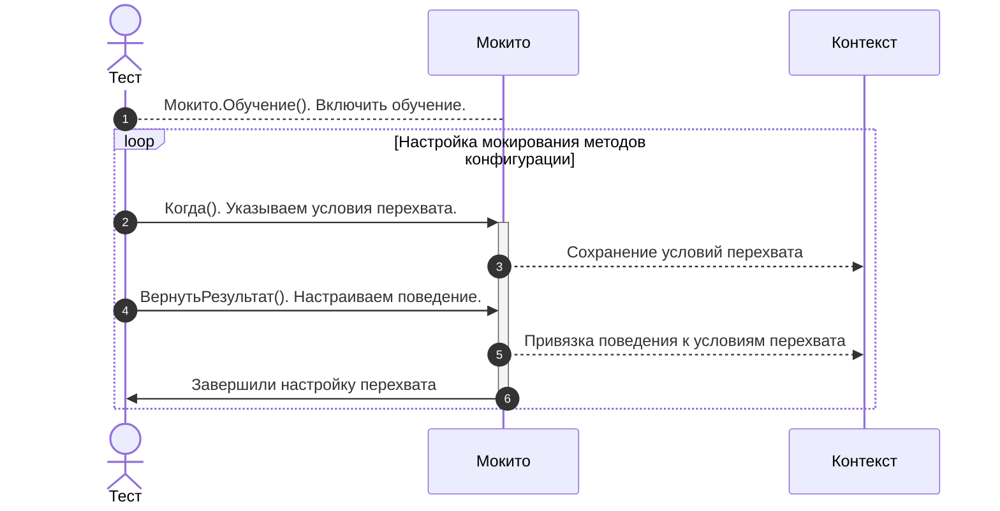
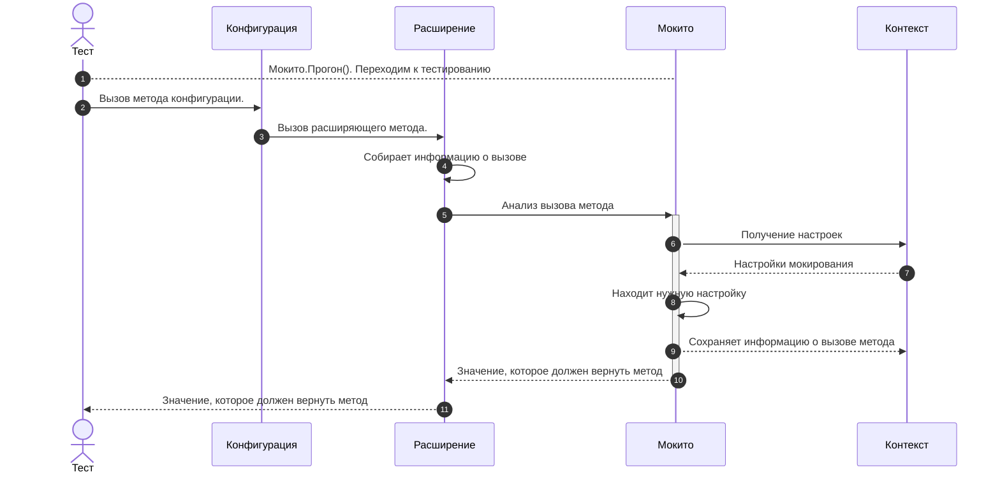

# Принципы работы Мокито

Мокито — это мощный инструмент для мокирования методов в 1С, который позволяет управлять поведением системы во время тестирования. Чтобы эффективно использовать Мокито, важно понимать его внутренние механизмы и принципы работы. В этой статье мы разберем, как работает Мокито, и какие основные принципы лежат в его основе.

---

## Основные принципы работы Мокито

Мокито работает на основе двух ключевых принципов:

1. **Расширение методов конфигурации**: Мокито заменяет реальные методы конфигурации на специальные обработчики, которые позволяют управлять их поведением.
2. **Глобальный контекст**: Все настройки мокирования и статистика вызовов хранятся в глобальном контексте, что позволяет синхронизировать данные между тестами и мокируемыми методами.

---

## Как Мокито заменяет методы?

Мокито использует механизм расширения конфигурации, чтобы перехватить вызовы методов. Для этого:

1. **Методы добавляются в расширение**: В расширении конфигурации создаются специальные обработчики методов, которые заменяют реальные методы.
2. **Обработчики перехватывают вызовы**: Когда метод вызывается, вместо реальной логики выполняется обработчик, который анализирует вызов и применяет настройки мокирования.
3. Подробнее принцип работы мокито описан в отдельной [статье](how-to.md)

### Пример обработчика для функции:

```bsl
&Вместо("<ИмяМетода>")
Функция Мок_<ИмяМетода>(<ПараметрыМетода>)
  ПараметрыМетода = Мокито.МассивПараметров(<ПараметрыМетода>);
  ПрерватьВыполнение = Ложь;
  Результат = МокитоПерехват.АнализВызова(<Объект>, "<ИмяМетода>", ПараметрыМетода, ПрерватьВыполнение);
  Если Не ПрерватьВыполнение Тогда
    Возврат ПродолжитьВызов(<ПараметрыМетода>);
  Иначе
    Возврат Результат;
  КонецЕсли;
КонецФункции
```

### Пример обработчика для процедуры:

```bsl
&Вместо("<ИмяМетода>")
Процедура Мок_<ИмяМетода>(<ПараметрыМетода>)
  ПараметрыМетода = Мокито.МассивПараметров(<ПараметрыМетода>);
  ПрерватьВыполнение = Ложь;
  МокитоПерехват.АнализВызова(<Объект>, "<ИмяМетода>", ПараметрыМетода, ПрерватьВыполнение);
  Если Не ПрерватьВыполнение Тогда
    ПродолжитьВызов(<ПараметрыМетода>);
  КонецЕсли;
КонецПроцедуры
```

---

## Глобальный контекст

Мокито использует глобальный контекст для хранения настроек мокирования и статистики вызовов. Это позволяет:

- Синхронизировать данные между тестами и мокируемыми методами.
- Сохранять настройки мокирования между вызовами.
- Собирать статистику по вызовам методов.

### Как это работает?

1. **Настройка мокирования**: При вызове метода `Мокито.Обучение()` настройки мокирования сохраняются в глобальном контексте.
2. **Анализ вызовов**: Когда мокируемый метод вызывается, обработчик обращается к глобальному контексту, чтобы определить, как нужно обработать вызов.
3. **Сбор статистики**: Если метод настроен на сбор статистики (например, через метод `Наблюдать()`), информация о вызовах сохраняется в глобальном контексте.

---

## Этапы работы Мокито

Мокито работает в три этапа:

1. **Обучение**: Настройка мокирования — указываем, какие методы нужно мокировать и как они должны себя вести.
2. **Прогон**: Выполнение тестового метода с применением настроенных моков.
3. **Проверка**: Анализ вызовов методов, чтобы убедиться, что все работает как ожидается.

### Пример:

```bsl
// Обучение
Мокито.Обучение(ОтправкаСМС_Провайдер1)
  .Когда("УстановитьСоединение").Вернуть(Истина)
  .Когда("ПослатьСообщение").Вернуть(Ответ)
  .Прогон();

// Прогон
РоботОтправки.ОтправкаСМС();

// Проверка
Мокито.Проверить(ОтправкаСМС_Провайдер1)
  .КоличествоВызовов("ПослатьСообщение")
  .Равно(1);
```

---

## Как настройки мокирования применяются?

Настройки мокирования состоят из двух частей:

1. **Условие вызова**: Указывает, при каких условиях (объект, метод, параметры) должно применяться мокирование.
2. **Реакция**: Определяет, как должен вести себя метод (вернуть значение, выбросить исключение, пропустить выполнение и т.д.).

### Пример настройки:

```bsl
Мокито.Обучение(РаботаСHTTP)
  .Когда("ОтправитьОбъектНаСервер", Мокито.МассивПараметров(ИсточникДанных, Данные))
  .Вернуть(2);
```

В этом примере:
- Условие: Метод `ОтправитьОбъектНаСервер` вызывается с параметрами `ИсточникДанных` и `Данные`.
- Реакция: Метод возвращает значение `2`.





