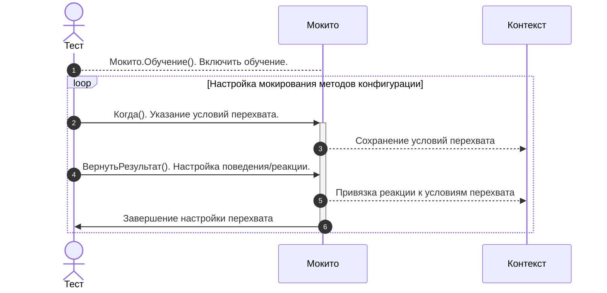
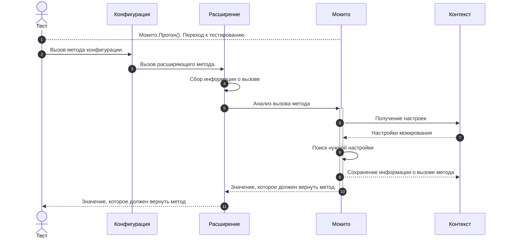

# Принципы работы Мокито

## Основные принципы работы Мокито

Мокито работает на основе двух ключевых компонентов:

1. **Расширение методов конфигурации**: Мокито заменяет реальные методы конфигурации на специальные обработчики, которые позволяют управлять их поведением.
2. **Глобальный контекст**: Все настройки мокирования и статистика вызовов хранятся в глобальном контексте, что позволяет синхронизировать данные между тестами и мокируемыми методами.

## Как Мокито заменяет методы?

Мокито использует механизм расширения конфигурации, чтобы перехватить вызовы методов. Для этого:

1. **Методы добавляются в расширение**:  
   Методы конфигурации заимствуются в расширении с директивой `&Вместо`. Это позволяет переопределить их поведение в рамках тестов.

2. **Заимствованные методы оформляются по специальному шаблону**:  
   Методы оформляются по [шаблону](mockito.md/#шаблоны-заимствованных-методов), который позволяет управлять вызовами метода. Шаблон включает логику для анализа параметров и применения настроек мокирования.

3. **Обработчики перехватывают вызовы**:  
   Когда метод вызывается, вместо реальной логики выполняется обработчик, который анализирует вызов и применяет настройки мокирования. Это позволяет изменять поведение метода в зависимости от условий.

4. **Вызов основного метода конфигурации**:  
   Если вызов не подходит под условия, указанные в тесте, выполняется вызов основного метода конфигурации с помощью `ПродолжитьВызов`. Это обеспечивает гибкость, позволяя тестам работать как с мокированными, так и с реальными методами.

## Глобальный контекст

Мокито использует глобальный [контекст](../../context.md) для хранения настроек мокирования и статистики вызовов. Это позволяет:

- **Выполнять из теста настройку мокирования**:  
  Настройки мокирования, такие как возвращаемые значения, исключения или условия вызова, задаются в тесте и сохраняются в глобальном контексте. Это делает процесс настройки простым и удобным.

- **Методы-перехватчики могут читать настройки из глобального контекста**:  
  Когда метод вызывается, перехватчик обращается к глобальному контексту, чтобы получить актуальные настройки мокирования. Это обеспечивает согласованность между тестами и мокированными методами.

- **Собирать статистику по вызовам методов**:  
  Вся информация о вызовах методов (количество вызовов, параметры) сохраняется в глобальном контексте. Эта статистика доступна в тесте для анализа, что позволяет проверять корректность работы тестируемого кода.

Таким образом, глобальный контекст служит централизованным хранилищем для управления мокированием и анализа вызовов, обеспечивая гибкость и удобство при написании тестов.

## Этапы работы Мокито

### Этап обучения

Обучение — это настройка Мокито, в ходе которой указываются условия мокирования методов и действия, выполняемые при мокировании.

Используя программный интерфейс Мокито, в тесте указываются **условия** перехвата методов:

- **Объект-владелец метода**:  
  Указывается с помощью [`Мокито.Обучение(Объект)`](/api/Мокито#обучение). Это объект, метод которого будет мокироваться.

- **Имя метода**:  
  Указывается с помощью [`Когда(ИмяМетода)`](/api/МокитоОбучение#когда) или [`Наблюдать(ИмяМетода)`](/api/МокитоОбучение#наблюдать). Определяет, какой именно метод будет перехвачен.

- **Параметры вызова (при необходимости)**:  
  Указываются с помощью [`Когда(ИмяМетода, КоллекцияПараметров)`](/api/МокитоОбучение#когда) или [`Наблюдать(ИмяМетода, КоллекцияПараметров)`](/api/МокитоОбучение#наблюдать). Позволяет задать условия для параметров метода.

**Пример**

```bsl title="Обучение Мокито"
// Начинаем настройку мокирования для объекта "РаботаСHTTP"
Мокито.Обучение(РаботаСHTTP)
  // Указываем, что мокируем метод "ОтправитьОбъектНаСервер"
  // и задаем параметры вызова: "ИсточникДанных" и "Данные"
  .Когда("ОтправитьОбъектНаСервер", Мокито.МассивПараметров(ИсточникДанных, Данные))
  // Настраиваем метод на возврат значения "2" при вызове с указанными параметрами
  .Вернуть(2);
```

В этом примере:

- **Условие**: Метод `ОтправитьОбъектНаСервер` общего модуля `РаботаСHTTP` вызывается с параметрами `ИсточникДанных` и `Данные`.
- **Реакция**: Метод возвращает значение `2`.

#### Особенности настройки условий на параметры вызова

- Если параметры не указаны, под условия подходят **все вызовы метода**.
- Если **часть параметров** не указана (например, первые два из трех), то под условия попадают вызовы, для которых совпадают указанные параметры. Остальные параметры не влияют на успешность проверки условия.
- Вместо конкретных значений параметров можно использовать [предикаты](/docs/features/predicates) и шаблоны:
  - [`Мокито.ЛюбойПараметр()`](/api/Мокито#любойпараметр): Подходит любой параметр.
  - [`Мокито.ЧисловойПараметр()`](/api/Мокито#числовойпараметр): Подходит любой числовой параметр.
  - [`Мокито.СтроковыйПараметр()`](/api/Мокито#строковыйпараметр): Подходит любой строковый параметр.
  - [`Мокито.ТипизированныйПараметр(Тип)`](/api/Мокито#типизированныйпараметр): Подходит параметр указанного типа.

:::tip ЛюбойПараметр
Если значение параметра не важно, можно использовать маску `Мокито.ЛюбойПараметр()`. Однако, если это последний параметр, его можно не указывать — эффект будет тем же. Это упрощает код и делает его более читаемым.

```bsl
// 1. Полная запись с использованием маски "ЛюбойПараметр" для второго параметра
// Указываем, что первый параметр должен быть "ПравильныйАдрес", а второй параметр может быть любым.
Мокито.Обучение(РаботаСHTTP)
    .Когда("ОтправитьОбъектНаСервер", МассивПараметров(ПравильныйАдрес, Мокито.ЛюбойПараметр()));

// 2. Упрощенная запись (если последний параметр не важен)
// Второй параметр можно не указывать, так как он автоматически считается "любым".
Мокито.Обучение(РаботаСHTTP)
    .Когда("ОтправитьОбъектНаСервер", МассивПараметров(ПравильныйАдрес));
```

:::

#### Особенности обучения для объектов конфигурации

Для каждого объекта конфигурации существуют разные типы данных

- Менеджер объетка
- Объект конфигурации
- Ссылка на объект

Менеджер и объект имеют свои наборы методов, а ссылка имеет только платформенные методы. С одной стороны все просто, для мокирования методов менеджера стоит обучать менеджер, а для методов объекта - объет.
Но как быть если требуется мокировать метод для любого объекта или у нас нет самого объекта, а есть ссылка на него или объект создается в тестируемом коде.

Для решения этих проблем в Мокито была добавлена кастомная логика:

* Через менеджер можно мокировать методы любого объекта
* Через ссылку - методы объекта с указанной ссылкой

|                             | Методы менеджера | Методы объект               |
|-----------------------------|------------------|-----------------------------|
| Обучение через **менеджер** | +                | Для всех объектов           |
| Обучение через **объект**   | -                | Для конкретного объекта     |
| Обучение через **ссылку**   | -                | Для объектов с этой ссылкой |

### Особенности обучения методов для объектов конфигурации

Для каждого объекта конфигурации существуют разные типы данных:

- **Менеджер объекта** — с методами для работы с объектами.
- **Объект конфигурации** — экземпляр объекта с методами объекта.
- **Ссылка на объект** — имеющая только платформенные методы.

Менеджер и объект имеют свои наборы методов, а ссылка поддерживает только платформенные методы. На первый взгляд всё просто: для мокирования методов менеджера нужно обучать менеджер, а для методов объекта — объект.
Однако возникают сложности, если требуется мокировать метод для любого объекта указанного типа, или если объект недоступен на этапе тестирования (например, есть только ссылка), или если объект создается внутри тестируемого кода.

Для решения этих проблем в **Мокито** была добавлена кастомная логика:

- Через **менеджер** можно мокировать методы для всех объектов определенного типа.
- Через **ссылку** можно мокировать методы для конкретного объекта с указанной ссылкой.

#### **Правила мокирования методов**

|                             | Методы менеджера           | Методы объекта                     |
|-----------------------------|----------------------------|------------------------------------|
| **Обучение через менеджер** | ✅ Да (например, `Создать()`) | ✅ Да (для **всех** объектов этого типа) |
| **Обучение через объект**   | ❌ Нет                      | ✅ Да (только для **конкретного** объекта) |
| **Обучение через ссылку**   | ❌ Нет                      | ✅ Да (для объектов с **этой ссылкой**) |

---

#### **Примеры использования**

##### 1. Мокирование **методов объекта**

```bsl
// Мокируем метод "РассчитатьСкидку" для конкретного документа
Док = Документы.Заказы.СоздатьДокумент();
Мокито.Обучение(Док)
    .Когда("РассчитатьСкидку")
    .Вернуть(15);

// Вызов
Скидка = Док.РассчитатьСкидку(); // Вернет 15
```

##### 2. Мокирование **методов для всех объектов через менеджер**

Обучение через менеджер позволяет мокировать метод для **всех объектов** определенного типа.

```bsl
// Мокируем пользовательский метод "ПолучитьСтатус" для всех документов "Заказ"
Мокито.Обучение(Документы.Заказы)
    .Когда("ПолучитьСтатус")
    .Вернуть("В обработке");

// Вызов
Док1 = Документы.Заказы.СоздатьДокумент();
Док2 = Документы.Заказы.СоздатьДокумент();
Статус1 = Док1.ПолучитьСтатус(); // Вернет "В обработке"
Статус2 = Док2.ПолучитьСтатус(); // Вернет "В обработке"
```

##### 3. Мокирование **через ссылку**

Если есть только ссылка на объект, можно мокировать методы для **конкретного объекта** с этой ссылкой.

```bsl
// Ссылка на документ
СсылкаНаДок = Справочники.Заказы.НайтиПоНомеру("Заказ-789");

// Мокируем пользовательский метод "ПолучитьКомментарий" для объекта с этой ссылкой
Мокито.Обучение(СсылкаНаДок)
    .Когда("ПолучитьКомментарий")
    .Вернуть("Тестовый заказ");

// Вызов
Док = СсылкаНаДок.ПолучитьОбъект();
Комментарий = Док.ПолучитьКомментарий(); // Вернет "Тестовый заказ"
```

#### Настройка условия через вызов метода

Мокито позволяет указать условия вызова через реальный вызов метода. Это делает настройку более интуитивно понятной и удобной.

```bsl
// Начинаем настройку мокирования для объекта "РаботаСHTTP"
Мокито.Обучение(РаботаСHTTP)
  // Указываем условие вызова через реальный вызов метода "ОтправитьОбъектНаСервер"
  // с параметрами "ИсточникДанных" и "Данные"
  .Когда(РаботаСHTTP.ОтправитьОбъектНаСервер(ИсточникДанных, Данные))
  // Настраиваем метод на возврат значения "2" при вызове с указанными параметрами
  .Вернуть(2)
```

После вызова `Мокито.Обучение(РаботаСHTTP)` все вызовы функций этого общего модуля возвращают информацию о параметрах вызова и не выполняют реальной работы, заложенной в методе. Это позволяет безопасно настраивать условия мокирования.

:::danger Обучаемый объект
Учитывайте, что любые обращения к методам обучаемого объекта просто возвращают информацию о вызове и не выполняют полезной работы до окончания обучения. Это важно для корректной настройки моков.
:::

#### Реакция на вызов

При соблюдении условий Мокито вызывает **реакцию** на этот вызов. Реакция задается в тесте с использованием методов:

- [`Вернуть()`](/api/МокитоОбучение#вернуть)  
  Настраивает метод на возврат определенного значения.
- [`ВыброситьИсключение()`](/api/МокитоОбучение#выброситьисключение)  
  Настраивает метод на выброс исключения.
- [`Пропустить()`](/api/МокитоОбучение#пропустить)  
  Отключает выполнение метода.
- [`ВыполнитьМетод()`](/api/МокитоОбучение#выполнитьметод)  
  Выполняет реальный метод конфигурации вместо мокированного.

Все настройки сохраняются в глобальный контекст, что обеспечивает их доступность для анализа и управления в процессе тестирования.

#### Схема работы обучения



### Этап прогона

После настройки мокирования необходимо перевести Мокито в режим прогона. Для этого вызывается метод `Прогон()`. Этот метод завершает этап обучения и активирует настройки мокирования.

```bsl
// Завершаем настройку мокирования и переводим Мокито в режим прогона
Мокито.Обучение(РаботаСHTTP)
  .Когда("ОтправитьОбъектНаСервер", Мокито.МассивПараметров(ИсточникДанных, Данные))
  .Вернуть(2)
  .Прогон(); // Активируем настройки мокирования

// Выполняем тестовый вызов метода и проверяем результат
ЮТест.ОжидаетЧто(РаботаСHTTP.ОтправитьОбъектНаСервер(ИсточникДанных, Данные))
  .Равно(2);
```

После перехода в режим прогона все вызовы методов будут обрабатываться в соответствии с настройками мокирования, что делает тесты более предсказуемыми и управляемыми.

#### Схема перехвата и обработки вызовов Мокито



#### Логика приоритизации условий для параметров в Мокито

Инструмент **Мокито** позволяет гибко настраивать условия для параметров методов, используя:

- **Конкретные значения**;
- **Маски** (например, `ЛюбойПараметр`, `ЧисловойПараметр`);
- **Предикаты** (пользовательские условия).

Не редко возникает ситуация когда параметры вызова подходят под разные условия.

```bsl
// Настройка поведения метода "ЗаписатьОбъект":
// 1. По умолчанию метод выбрасывает исключение "Некорректный вызов".
// 2. Если метод вызывается с параметром "НужныйДокумент", он выполняется как обычно.
Мокито.Обучение(СинхронизацияДанных)
    .Когда("ЗаписатьОбъект").ВыброситьИсключение("Некорректный вызов")
    .Когда("ЗаписатьОбъект", Мокито.МассивПараметров(НужныйДокумент)).ВыполнитьМетод()
```

Этот пример настраивает метод `ЗаписатьОбъект` так, чтобы:

- По умолчанию выбрасывалось исключение.
- А для конкретного документа (`НужныйДокумент`) метод выполнялся как обычно.

Этот пример работает за счет приоритизации условий
Приоритеты условий определяются на основе **типа указанного условия**(параметра).
Рассмотрим, как это работает.

##### **Типы условий и их приоритеты**

Каждое условие имеет **приоритет** (число), который определяет его вес при выборе реакции на вызов метода.  
Чем выше приоритет, тем важнее условие.

| **Тип условия**         | **Приоритет** | **Описание**                                                             |
|-------------------------|---------------|--------------------------------------------------------------------------|
| **Конкретное значение** | `100`         | Точное совпадение значения параметра (например, `42`, `"Тест"`).         |
| **Предикат**            | `90`          | Пользовательская функция-условие (например, `Значение > 0`).             |
| **Тип данных**          | `10`          | Проверка типа параметра (например, `ЧисловойПараметр`, `Тип("Строка")`). |
| **Любой параметр**      | `0`           | Универсальная маска, подходит для любого значения (`ЛюбойПараметр`).     |

---

##### **Как выбирается условие?**

1. **Совпадение по параметрам**:  
   При вызове метода система проверяет все зарегистрированные условия и вычисляет **суммарный приоритет** для каждого набора параметров.  
   Например:  
   - Условие 1: `[ЧисловойПараметр(), ЛюбойПараметр()]` → сумма приоритетов: `10 + 0 = 10`.  
   - Условие 2: `[42, "Тест"]` → сумма приоритетов: `100 + 100 = 200`.  

   Система выберет условие с **наибольшим суммарным приоритетом** (в примере — условие 2).

2. **Порядок регистрации**:  
   Если несколько условий имеют одинаковый суммарный приоритет, выбирается **первое зарегистрированное** условие.

---

##### **Примеры приоритизации**

###### 1. **Конкретное значение vs. Тип данных**

```bsl

Мокито.Обучение(Объект)
    // Условие 1: Любое число
    .Когда("Метод", Мокито.МассивПараметров(Мокито.ЧисловойПараметр()))
    .Вернуть(0);
    // Условие 2: Конкретное значение 42
    .Когда("Метод", Мокито.МассивПараметров(42))
    .Вернуть(100)
  .Прогон();

// Вызов:
Объект.Метод(42); // Сработает условие 2 (приоритет 100 > 10)
```

###### 2. **Предикат vs. Конкретное значение**

```bsl
// Условие 1: Значение > 0 (предикат)
Мокито.Обучение(Объект)
    .Когда("Метод", Мокито.МассивПараметров(Мокито.Параметр(ЮТест.Предикат().Больше(0))))
    .Вернуть(200);

// Условие 2: Конкретное значение 10
Мокито.Обучение(Объект)
    .Когда("Метод", Мокито.МассивПараметров(10))
    .Вернуть(100);

// Вызов:
Объект.Метод(10); // Сработает условие 2 (приоритет 100 > 90)
```

##### **Рекомендации**

- Используйте **конкретные значения** для точных проверок.
- Применяйте **предикаты** для сложных условий (например, диапазоны чисел, частичное совпадение строк, проверка реквизитов структуры).
