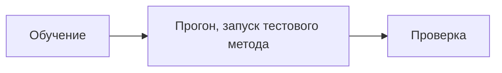

# Мокито

[Мокито](/api/Мокито) — это модуль, созданный по образцу популярного Java-фреймворка для тестирования [Mockito](https://site.mockito.org/). Он расширяет возможности тестирования, позволяя легко изменять поведение системы, подменяя результаты работы методов, отключая алгоритмы и проверки.

## Что такое мокирование?

Мокирование — это техника, которая позволяет заменить реальное поведение методов на заранее заданное. Это полезно, когда:

- Вы хотите протестировать код, который зависит от внешних систем или сложных алгоритмов.
- Вы хотите убедиться, что методы вызываются с правильными параметрами.
- Вы хотите отключить часть логики, чтобы сосредоточиться на тестировании конкретного участка кода.

## Возможности Мокито

С помощью Мокито вы можете:

- **Изменять поведение методов**: Указывать, в каких случаях методы должны возвращать определенные значения, выбрасывать исключения или вообще не выполняться.
- **Настраивать условия**: Задавать условия для параметров методов, чтобы изменения применялись только в нужных случаях.
- **Мокировать приватные и экспортные методы**: Мокировать как публичные, так и приватные методы объектов, документов, справочников и других элементов.
- **Собирать статистику**: Наблюдать за вызовами методов, чтобы убедиться, что они вызываются с правильными параметрами.

```bsl
ТелоОтвета = Новый Структура("success": Истина);
// Настройка мокирования
Мокито.Обучение(РаботаСHTTP)
  .Когда("ОтправитьЗапрос").Вернуть(
    ЮТест.Данные().HTTPОтвет()
      .УстановитьКодСостояния(200)
      .УстановитьТело(ТелоОтвета))
  .Прогон();

// Тестовый прогон
Результат = РаботаСHTTP.ОтправитьЗапрос("https://example.com");

// Проверка
ЮТест.ОжидаетЧто(Результат.КодСостояния).Равно(200);
```

Мокирование доступно для любых методов конфигурации (или почти любых):

- Методы общих модулей
- Методы менеджеров
- Методы объектов (документов, справочников и т.д.)
- Методы отчетов и обработок
- События объектов конфигурации
- Методы модулей прочих объектов конфигурации

## Что Мокито не может?

- Выполнять произвольную логику при вызове метода.
- Изменять параметры методов.
- Хранить результаты вызовов при сборе статистики.

## Как работает Мокито?

Мокито работает на основе двух ключевых механизмов:

1. **Расширение методов**: Методы конфигурации заменяются (`&Вместо`) на специальные обработчики, которые позволяют управлять их поведением.
2. **Глобальный контекст**: Все настройки и статистика вызовов хранятся в глобальном контексте, что позволяет получить к ним доступ как из теста (для настройки), так и из замененных методов (для анализа).

:::warning Ограничение
Мокито работает через **заимствование методов конфигурации**, что накладывает определенные ограничения. Подмена поведения возможна **только для методов конфигурации**. Это означает, что мокирование недоступно для:

- Методов платформы (встроенных методов 1С).
- Методов расширений.
- Методов внешних обработок или отчетов.

Таким образом, Мокито эффективно работает только в рамках методов, определенных в самой конфигурации. Это важно учитывать при проектировании тестов и выборе подходов к тестированию.
:::

Детально принципы работы Мокито описаны в отдельной [статье](./how-to.md). Она поможет вам глубже разобраться в механизмах мокирования, понять, как работает подмена методов, настройка поведения и сбор статистики вызовов. Это полезно для тех, кто хочет максимально эффективно использовать Мокито в своих тестах и лучше понять его внутреннюю логику.

## Подготовка

В первую очередь, необходимо добавить мокируемый метод в расширение конфигурации. Это можно сделать с помощью стандартной команды IDE **"Добавить метод в расширение"**. После этого нужно добавить шаблонный код для мокирования.

Для упрощения процесса:

- В **EDT** доступны [специальные команды](/docs/getting-started/edt-plugin/#команды-помощники), которые автоматически добавляют необходимый код для моков.
- В **конфигураторе** можно использовать готовые шаблоны, чтобы быстро настроить мокирование.

### Шаблоны заимствованных методов

- Для функции:

  ```bsl
  &Вместо("<ИмяМетода>")
  Функция Мок_<ИмяМетода>(<ПараметрыМетода>)
    ПараметрыМетода = Мокито.МассивПараметров(<ПараметрыМетода>);
    ПрерватьВыполнение = Ложь;
    Результат = МокитоПерехват.АнализВызова(<Объект>, "<ИмяМетода>", ПараметрыМетода, ПрерватьВыполнение);
    Если Не ПрерватьВыполнение Тогда
      Возврат ПродолжитьВызов(<ПараметрыМетода>);
    Иначе
      Возврат Результат;
    КонецЕсли;
  КонецФункции
  ```

- Для процедуры:

  ```bsl
  &Вместо("<ИмяМетода>")
  Процедура Мок_<ИмяМетода>(<ПараметрыМетода>)
    ПараметрыМетода = Мокито.МассивПараметров(<ПараметрыМетода>);
    ПрерватьВыполнение = Ложь;
    МокитоПерехват.АнализВызова(<Объект>, "<ИмяМетода>", ПараметрыМетода, ПрерватьВыполнение);
    Если Не ПрерватьВыполнение Тогда
      ПродолжитьВызов(<ПараметрыМетода>);
    КонецЕсли;
  КонецПроцедуры
  ```

**Параметры:**

- `<ИмяМетода>` — Имя мокируемого метода.
- `<ПараметрыМетода>` — Параметры мокируемого метода.
- `<Объект>` — Объект-владелец метода:
  - Для общих модулей — ссылка на общий модуль (например, `ОбщегоНазначения`). Лучше не использовать `ЭтотОбъект`.
  - Для объектов (справочники, документы, наборы, формы) — `ЭтотОбъект`.
  - Для менеджеров — ссылка на менеджер (например, `Справочники.Пользователи`).

:::tip Совет
Если метод не имеет параметров, можно использовать пустой массив:

```bsl
ПараметрыМетода = Новый Массив;
```

:::

## Этапы тестирования с Мокито

После добавления заимствованного метода-перехватчика в расширение конфигурации, вы можете начинать писать тесты с использованием Мокито для этого метода.



В общем случае тестирование с использованием Мокито состоит из трех этапов:

1. **Обучение**:  
   На этом этапе настраивается мокирование — указывается, какие методы нужно мокировать, при каких условиях (параметрах) и как они должны себя вести. Вы задаете поведение моков, например, возврат определенных значений, выброс исключений или пропуск выполнения.

2. **Прогон**:  
   На этом этапе выполняется тестовый метод с применением настроенных моков. Вызывается проверяемая функция, которая использует мокируемые методы. В процессе выполнения вместо реальных методов используются их моки, что позволяет изолировать тестируемую логику.

3. **Проверка**:  
   На завершающем этапе анализируются вызовы методов, чтобы убедиться, что все работает как ожидается. Проверяется, сколько раз методы были вызваны, с какими параметрами и в правильной ли последовательности.

**Пример:**

```bsl
// Подготовка
Ответ = ЮТест.Данные().HTTPОтвет()
  .УстановитьКодСостояния(200)
  .УстановитьТело(Новый Структура("id, status", "9999", "delivered"));

// Обучение Мокито
Мокито.Обучение(ОтправкаСМС_Провайдер1)
  .Когда("УстановитьСоединение").Вернуть(Истина)
  .Когда("ПослатьСообщение").Вернуть(Ответ)
  .Прогон();

// Тестовый прогон
РоботОтправки.ОтправкаСМС();

// Проверка статистики
Мокито.Проверить(ОтправкаСМС_Провайдер1)
  .КоличествоВызовов("ПослатьСообщение")
  .Равно(1);
```

### Обучение мокирования

Обучение — это процесс настройки Мокито. Вы указываете, какие методы и при каких условиях должны изменить свое поведение.

#### Основные методы обучения

- [**Когда()**](/api/МокитоОбучение#когда):  
  Указывает, какой метод и с какими параметрами нужно мокировать. Позволяет задать условия для вызова метода.

- [**Вернуть()**](/api/МокитоОбучение#вернуть):  
  Настраивает метод на возврат определенного значения. Используется для имитации успешного выполнения метода.

- [**ВыброситьИсключение()**](/api/МокитоОбучение#выброситьисключение):  
  Настраивает метод на выброс исключения. Полезно для тестирования обработки ошибок.

- [**Пропустить()**](/api/МокитоОбучение#пропустить):  
  Отключает выполнение метода. Используется для имитации пропуска вызова метода.

- [**Наблюдать()**](/api/МокитоОбучение#наблюдать):  
  Собирает статистику по вызовам метода. Позволяет отслеживать, сколько раз метод был вызван и с какими параметрами **без изменения его поведения**.

- [**ВыполнитьМетод()**](/api/МокитоОбучение#выполнитьметод):  
  Не выполнять мокирование, а выполнить метод конфигурации. Используется для вызова реального метода вместо мокированного.

:::tip Сбор статистики
Сбор статистики вызовов выполняется для всех мокируемых методов, а не только указанных в `Наблюдать()`. Это позволяет анализировать все вызовы, даже если они не были явно настроены для наблюдения.
:::

**Пример:**

```bsl
Мокито.Обучение(ОтправкаСМС_Провайдер1)
  .Когда("УстановитьСоединение").Пропустить()
  .Когда("ПослатьСообщение").Вернуть(Ответ)
  .Наблюдать("ОбработатьОтвет")
```

### Проверка вызовов

После прогона теста можно проверить, какие методы были вызваны и с какими параметрами. Для этого используется метод `Мокито.Проверить()`.

**Пример:**

```bsl
Мокито.Проверить(РаботаСHTTP)
  .КоличествоВызовов("ОтправитьОбъектНаСервер")
    .Равно(3);
```

```bsl
Мокито.Обучение(СуперИнтеграция)
  .Наблюдать("СоздатьОбъект")
  .Наблюдать("УдалитьОбъект")
  .Наблюдать("ОбновитьОбъект")
  .Прогон();

СуперИнтеграция.ВыполнитьСинхронизацию();

Мокито.Проверить(СуперИнтеграция)
  .КоличествоВызовов("СоздатьОбъект").Равно(1)
  .КоличествоВызовов("УдалитьОбъект").Пусто()
  .КоличествоВызовов("ОбновитьОбъект").Равно(1);
```

## Примеры использования

### Пример 1: Вызов исключения при записи объекта

Рассмотрим пример теста, где с помощью Мокито проверяется обработка исключений при записи документа "Оплата".

```bsl
// Настраиваем мокирование для метода "ПередЗаписью" документа "Оплата"
Мокито.Обучение(Документы.Оплата)
    .Когда("ПередЗаписью") // Указываем, что мокируем метод "ПередЗаписью"
    .ВыброситьИсключение("Не удалось записать объект") // Настраиваем метод на выброс исключения
    .Прогон(); // Завершаем настройку моков

// Создаем объект документа "Оплата"
Документ = СоздатьДокументОплаты();

// Проверяем, что при вызове метода "Записать" с параметром "Проведение" выбрасывается исключение
ЮТест.ОжидаетЧто(Документ)
    .Метод("Записать") // Указываем метод, который должен быть вызван
    .Параметр(РежимЗаписиДокумента.Проведение) // Указываем параметр, с которым метод должен быть вызван
    .ВыбрасываетИсключение("Не удалось записать объект"); // Ожидаем, что метод выбросит исключение с указанным текстом
```

- Тест демонстрирует, как можно использовать мокирование для проверки сценариев, связанных с обработкой исключений.
- Метод `ПередЗаписью` мокируется, чтобы имитировать ошибку при записи документа, что позволяет проверить реакцию системы на такие ситуации.

### Пример 2: Анализ вызовов метода

Рассмотрим пример теста, где с помощью Мокито настраивается наблюдение за вызовами методов общего модуля `СинхронизацияДанных`. В этом тесте мы проверяем, что методы `СоздатьОбъект`, `УдалитьОбъект` и `ОбновитьОбъект` вызываются ожидаемое количество раз в процессе выполнения синхронизации. Это позволяет убедиться, что логика вызовов методов соответствует требованиям.

```bsl
// Настраиваем мокирование для объекта "СинхронизацияДанных"
Мокито.Обучение(СинхронизацияДанных)
    .Наблюдать("СоздатьОбъект") // Начинаем наблюдение за методом "СоздатьОбъект"
    .Наблюдать("УдалитьОбъект") // Начинаем наблюдение за методом "УдалитьОбъект"
    .Наблюдать("ОбновитьОбъект") // Начинаем наблюдение за методом "ОбновитьОбъект"
    .Прогон(); // Завершаем настройку моков

// Выполняем метод, который тестируем
СинхронизацияДанных.ВыполнитьСинхронизацию();

// Проверяем, сколько раз были вызваны наблюдаемые методы
Мокито.Проверить(СинхронизацияДанных)
    .КоличествоВызовов("СоздатьОбъект").Равно(1) // Ожидаем, что метод "СоздатьОбъект" был вызван 1 раз
    .КоличествоВызовов("УдалитьОбъект").Пусто() // Ожидаем, что метод "УдалитьОбъект" не был вызван ни разу
    .КоличествоВызовов("ОбновитьОбъект").Равно(1); // Ожидаем, что метод "ОбновитьОбъект" был вызван 1 раз
```

1. **Наблюдение за методами**:
   - Используется метод `.Наблюдать()`, чтобы отслеживать вызовы методов без изменения их поведения.
   - Это позволяет проверить, какие методы были вызваны и сколько раз, не вмешиваясь в их логику.

2. **Проверка количества вызовов**:
   - Метод `КоличествоВызовов()` используется для проверки, сколько раз был вызван каждый из наблюдаемых методов.
   - Проверяется, что:
     - `СоздатьОбъект` был вызван **1 раз**.
     - `УдалитьОбъект` не был вызван ни разу (проверка на пустоту).
     - `ОбновитьОбъект` был вызван **1 раз**.

- Такой подход полезен для проверки корректности логики вызовов методов в процессе выполнения сложных операций.
- Тест позволяет убедиться, что методы вызываются в правильной последовательности и с ожидаемой частотой.
- При необходимости можно проверить с условием на параметры вызова.

### Пример 3: Тест передачи параметров с использованием выброса исключения

Рассмотрим пример, где с помощью Мокито настраивается выброс исключений при "некорректных" вызовах методов, разрешаются только корректные вызовы с определенными параметрами, и проверяется, что основной алгоритм выполняется без ошибок и вызывает методы ожидаемое количество раз.

```bsl
// Определяем текст исключения, которое будет выбрасываться при "некорректных" вызовах
ТекстИсключение = "Некорректный вызов";

// Создаем объект для обновления
СсылкаДляОбновления = СоздатьОбъект(Код);

// Настраиваем мокирование для объекта "СинхронизацияДанных"
Мокито.Обучение(СинхронизацияДанных)
    .Когда("СоздатьОбъект").ВыброситьИсключение(ТекстИсключение) // При любом вызове "СоздатьОбъект" выбрасываем исключение
    .Когда("УдалитьОбъект").ВыброситьИсключение(ТекстИсключение) // При любом вызове "УдалитьОбъект" выбрасываем исключение
    .Когда("ОбновитьОбъект").ВыброситьИсключение(ТекстИсключение) // При любом вызове "ОбновитьОбъект" выбрасываем исключение
    .Когда("ОбновитьОбъект", Мокито.МассивПараметров(СсылкаДляОбновления)).ВыполнитьМетод() // Разрешаем вызов "ОбновитьОбъект" только с определенной ссылкой
    .Прогон(); // Завершаем настройку моков

// Проверяем, что метод "ВыполнитьСинхронизацию" не выбрасывает исключение
ЮТест.ОжидаетЧто(СинхронизацияДанных)
    .Метод("ВыполнитьСинхронизацию").НеВыбрасываетИсключение(); // Ожидаем, что метод выполнится без ошибок

// Проверяем, что метод "ОбновитьОбъект" был вызван ровно 1 раз
Мокито.Проверить(СинхронизацияДанных)
    .КоличествоВызовов("ОбновитьОбъект").Равно(1); // Ожидаем, что метод "ОбновитьОбъект" был вызван 1 раз
```

**Особенности**

1. **Настройка исключений**:
   - Методы `СоздатьОбъект`, `УдалитьОбъект` и `ОбновитьОбъект` настроены на выброс исключения с текстом `"Некорректный вызов"`.
   - Это позволяет имитировать "некорректные" вызовы и проверять, как система реагирует на такие ситуации.

2. **Разрешение корректного вызова**:
   - Для метода `ОбновитьОбъект` добавлено исключение: если метод вызывается с определенной ссылкой (`СсылкаДляОбновления`), он выполняется без ошибок.
   - Это позволяет проверить, что только корректные вызовы проходят успешно.

### Пример 4: Условия по параметрам

### Пример 5: Предикаты

```bsl
// Сигнатура проверяемого метода:
// Интеграция.ВыполнитьЗапрос(URL: Строка, Тело: Структура, Строка, Произвольный);

// Определяем адрес для тестирования
Адрес = "service.ru";

// Используем Мокито.ЛюбойПараметр() для указания, что параметр может быть любым
ЛюбойПараметр = Мокито.ЛюбойПараметр();

// Создаем условие для проверки структуры: она должна содержать реквизит "Флаг" со значением 1
УсловиеСтруктура = ЮТест.Предикат()
    .ИмеетТип("Структура") // Проверяем, что параметр является структурой
    .Реквизит("Флаг").Равно(1) // Проверяем, что реквизит "Флаг" равен 1
    .Получить(); // Завершаем создание предиката

// Настраиваем мокирование для метода "ВыполнитьЗапрос"
Мокито.Обучение(Интеграция)
    // Если вызов не подошел ни под одно условие, выбрасываем исключение
    .Когда("ВыполнитьЗапрос")
    .ВыброситьИсключение("Не отработал перехват")

    // Условие 1: запрос на любой адрес, в качестве тела передана структура с реквизитом "Флаг" равным 1
    .Когда("ВыполнитьЗапрос", Мокито.МассивПараметров(
      ЛюбойПараметр,
      УсловиеСтруктура))
    .Вернуть(1) // Возвращаем 1, если условие выполнено

    // Условие 2: запрос на любой адрес, в качестве тела передана структура с реквизитом "Флаг" равным 2
    .Когда("ВыполнитьЗапрос", Мокито.МассивПараметров(
      ЛюбойПараметр, 
      ЮТест.Предикат()
        .Реквизит("Флаг").Равно(2)))
    .Вернуть(2) // Возвращаем 2, если условие выполнено

    // Условие 3: запрос на любой адрес, в качестве тела передан массив, где первый элемент равен 3
    .Когда("ВыполнитьЗапрос", Мокито.МассивПараметров(
      ЛюбойПараметр, 
      ЮТест.Предикат()
        .ИмеетТип("Массив")
        .Реквизит(0).Равно(3)))
    .Вернуть(3) // Возвращаем 3, если условие выполнено

    // Условие 4: запрос на любой адрес, в качестве тела передано значение 4
    .Когда("ВыполнитьЗапрос", Мокито.МассивПараметров(
      ЛюбойПараметр,
      ЮТест.Предикат().Равно(4)))
    .Вернуть(4) // Возвращаем 4, если условие выполнено

    // Условие 5: запрос на адрес, содержащий "com", и тело равно 4
    .Когда("ВыполнитьЗапрос", Мокито.МассивПараметров(
      ЮТест.Предикат().Содержит("com"), 
      ЮТест.Предикат().Равно(4)))
    .Вернуть(5) // Возвращаем 5, если условие выполнено

    // Условие 6: запрос на адрес, содержащий "org", и тело равно 4
    .Когда("ВыполнитьЗапрос", Мокито.МассивПараметров(
      ЮТест.Предикат().Содержит("org").Получить(),
      ЮТест.Предикат().Равно(4)))
    .Вернуть(6) // Возвращаем 6, если условие выполнено
    .Прогон(); // Завершаем настройку моков

// Проверяем различные сценарии вызова метода "ВыполнитьЗапрос"

// Сценарий 1: запрос с адресом "service.ru" и телом в виде структуры с реквизитом "Флаг" равным 1
ЮТест.ОжидаетЧто(Интеграция.ВыполнитьЗапрос(Адрес, Новый Структура("Флаг", 1)))
    .Равно(1); // Ожидаем, что метод вернет 1

// Сценарий 2: запрос с адресом "service.ru" и телом равным 4
ЮТест.ОжидаетЧто(Интеграция.ВыполнитьЗапрос(Адрес, 4))
    .Равно(4); // Ожидаем, что метод вернет 4

// Сценарий 3: запрос с адресом "service.com" и телом равным 4
ЮТест.ОжидаетЧто(Интеграция.ВыполнитьЗапрос("service.com", 4))
    .Равно(4); // Ожидаем, что метод вернет 4 (не 5, так как предикат не завершен методом Получить)

// Сценарий 4: запрос с адресом "service.org" и телом равным 4
ЮТест.ОжидаетЧто(Интеграция.ВыполнитьЗапрос("service.org", 4))
    .Равно(6); // Ожидаем, что метод вернет 6

// Сценарий 5: запрос с адресом "service.ru" и телом в виде массива, где первый элемент равен 3
ЮТест.ОжидаетЧто(Интеграция.ВыполнитьЗапрос(Адрес, ЮТКоллекции.ЗначениеВМассиве(3)))
    .Равно(3); // Ожидаем, что метод вернет 3

// Сценарий 6: запрос с адресом "service.ru" и телом в виде структуры с реквизитом "Флаг" равным 2
ЮТест.ОжидаетЧто(Интеграция.ВыполнитьЗапрос(Адрес, Новый Структура("Флаг", 2)))
    .Равно(2); // Ожидаем, что метод вернет 2
```

**Описание теста**

1. **Настройка моков**:
   - Используется `Мокито.Обучение` для настройки поведения метода `ВыполнитьЗапрос`.
   - Определены различные условия для вызова метода, каждое из которых возвращает определенное значение.
   - Если вызов не соответствует ни одному из условий, выбрасывается исключение.

2. **Проверка сценариев**:
   - Тест проверяет различные сценарии вызова метода `ВыполнитьЗапрос` с разными параметрами.
   - Используются предикаты для проверки структуры, типа данных и значений параметров.

3. **Особенности**:
   - Если несколько предикатов используются в условиях параметров, необходимо завершать их методом `Получить`, иначе они не будут работать корректно, пример, сценарий 5, который не отработал.
   - Тест демонстрирует гибкость мокирования и проверки различных условий.

Этот тест позволяет убедиться, что метод `ВыполнитьЗапрос` корректно обрабатывает различные входные данные и возвращает ожидаемые результаты.

### Пример 6: Цепочка вызовов

```bsl
// Настраиваем мокирование для метода "ВыполнитьЗапрос"
Мокито.Обучение(Интеграция)
    .Когда("ВыполнитьЗапрос") // Указываем, что мокируем метод "ВыполнитьЗапрос"
    .Вернуть(1) // Первый вызов метода вернет 1
    .Вернуть(2) // Второй вызов метода вернет 2
    .Вернуть(3) // Третий и все последующие вызовы метода вернут 3
    .Прогон(); // Завершаем настройку моков

// Проверяем цепочку вызовов метода "ВыполнитьЗапрос"

// Первый вызов: ожидаем, что метод вернет 1
ЮТест.ОжидаетЧто(Интеграция.ВыполнитьЗапрос(ПроизвольныйАдрес))
    .Равно(1); // Проверяем, что результат равен 1

// Второй вызов: ожидаем, что метод вернет 2
ЮТест.ОжидаетЧто(Интеграция.ВыполнитьЗапрос(ПроизвольныйАдрес))
    .Равно(2); // Проверяем, что результат равен 2

// Третий вызов: ожидаем, что метод вернет 3
ЮТест.ОжидаетЧто(Интеграция.ВыполнитьЗапрос(ПроизвольныйАдрес))
    .Равно(3); // Проверяем, что результат равен 3

// Четвертый вызов: ожидаем, что метод снова вернет 3 (последнее значение в цепочке)
ЮТест.ОжидаетЧто(Интеграция.ВыполнитьЗапрос(ПроизвольныйАдрес))
    .Равно(3); // Проверяем, что результат равен 3
```

**Описание теста**

1. **Настройка моков**:
   - Используется `Мокито.Обучение` для настройки поведения метода `ВыполнитьЗапрос`.
   - Метод настроен на возврат разных значений при каждом вызове: сначала `1`, затем `2`, а затем `3` для всех последующих вызовов.

2. **Проверка цепочки вызовов**:
   - Тест проверяет, что метод `ВыполнитьЗапрос` возвращает значения в соответствии с заданной цепочкой.
   - Первый вызов возвращает `1`, второй — `2`, третий и все последующие — `3`.

3. **Особенности**:
   - Тест демонстрирует возможность настройки последовательных возвращаемых значений для одного и того же метода.
   - После исчерпания цепочки значений метод продолжает возвращать последнее указанное значение (`3` в данном случае).

Этот тест полезен для проверки сценариев, где метод вызывается несколько раз, и каждое его выполнение должно возвращать разные значения в зависимости от порядка вызова.

## Преимущества Мокито

1. **Гибкость**:  
   Мокито позволяет мокировать как экспортные, так и приватные методы, а также настраивать условия вызова. Это дает возможность тестировать сложные сценарии, где требуется изоляция отдельных компонентов системы.

2. **Простота использования**:  
   Интуитивно понятный API позволяет быстро настраивать мокирование. Благодаря текучим выражениям, настройка моков становится простой и читаемой, что ускоряет процесс написания тестов.

3. **Глобальный контекст**:  
   Все настройки и статистика хранятся в одном месте, что упрощает управление мокированием. Это позволяет легко отслеживать вызовы методов и проверять их корректность.

---

## Заключение

Мокито — это мощный инструмент для управления поведением системы во время тестирования. Его принципы работы основаны на расширении методов конфигурации и использовании глобального контекста для хранения настроек и статистики. Понимание этих принципов поможет вам эффективно использовать Мокито для написания качественных тестов.
