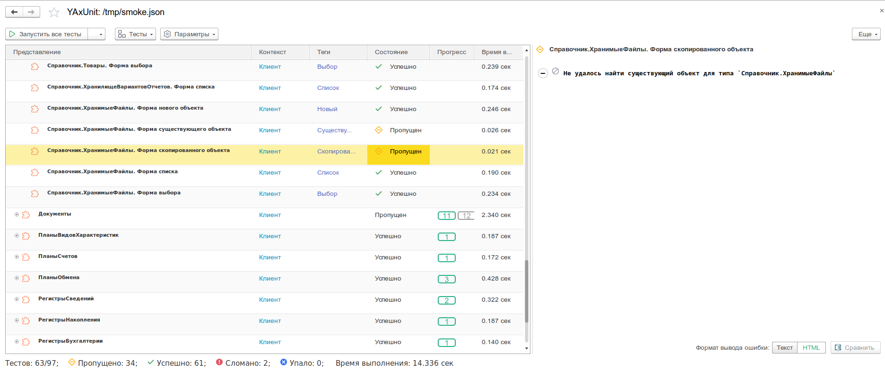

# Тестирование открытия форм

## Возможности

Дымовые тесты открытия форм, позволяют проверить, что все основные формы решения открываются, не выбрасывая исключений.



:::caution
Формы открываются в том же сеансе. Менеджер и клиент тестирования не используется.
:::

### Виды тестов

Реализованно несколько видов тестов открытия форм

* `Новый` - Открывает форму **нового** объекта.
* `НоваяГруппа` - Открывает форму **новой группы**.
* `Существующий` - Открывает форму **существующего** объекта.
* `СуществующаяГруппа` - Открывает форму **существующей группы**.
* `Скопированный` - Открывает форму **скопированного** объект.
* `СкопированнаяГрупп` - Открывает форму **скопированной группы**.
* `Список` - Открывает форму **списка**.
* `Выбор` - Открывает форму **выбора**.
* `ВыборГруппы` - Открывает форму **выбора группы**.
* `Основная` - Открывает форму **основная**, для отчетов и обработок.
* `Настройки` - Открывает форму **настройки отчета**.
* `Варианты` - Открывает форму **выбора варианта**.

### Объекты метаданных

Поддерживается большинство объектов метаданных

| Имя                     | Новый | НоваяГруппа | Существующий | СуществующаяГруппа | Скопированный | СкопированнаяГруппа | Список | Выбор | ВыборГруппы | Основная | Настройки | Варианты |
|-------------------------|-------|-------------|--------------|--------------------|---------------|---------------------|--------|-------|-------------|----------|-----------|----------|
| Справочники             | ✓     | ✓           | ✓            | ✓                  | ✓             | ✓                   | ✓      | ✓     | ✓           |          |           |          |
| Документы               | ✓     |             | ✓            |                    | ✓             |                     | ✓      | ✓     |             |          |           |          |
| ПланыВидовХарактеристик | ✓     | ✓           | ✓            | ✓                  | ✓             | ✓                   | ✓      | ✓     | ✓           |          |           |          |
| ПланыСчетов             | ✓     |             | ✓            |                    | ✓             |                     | ✓      | ✓     |             |          |           |          |
| ПланыВидовРасчета       | ✓     |             | ✓            |                    | ✓             |                     | ✓      | ✓     |             |          |           |          |
| ПланыОбмена             | ✓     |             | ✓            |                    | ✓             |                     | ✓      | ✓     |             |          |           |          |
| БизнесПроцессы          | ✓     |             | ✓            |                    | ✓             |                     | ✓      | ✓     |             |          |           |          |
| Задачи                  | ✓     |             | ✓            |                    | ✓             |                     | ✓      | ✓     |             |          |           |          |
| РегистрыСведений        | ✓     |             | ✓            |                    | ✓             |                     | ✓      | ✓     |             |          |           |          |
| РегистрыНакопления      |       |             | ✓            |                    |               |                     | ✓      | ✓     |             |          |           |          |
| РегистрыБухгалтерии     |       |             | ✓            |                    |               |                     | ✓      | ✓     |             |          |           |          |
| РегистрыРасчета         |       |             | ✓            |                    |               |                     | ✓      | ✓     |             |          |           |          |
| Перечисления            |       |             |              |                    |               |                     | ✓      | ✓     |             |          |           |          |
| Отчеты                  |       |             |              |                    |               |                     |        |       |             | ✓        | ✓         | ✓        |
| Обработки               |       |             |              |                    |               |                     |        |       |             | ✓        |           |          |

### Учет прав

При формировании списка тестов учитываются права доступа текущего пользователя, что позволит выполнить тестирование для разных ролевых моделей

| Вид теста           | Необходимое право       | Используемая форма |
|---------------------|-------------------------|--------------------|
| Новый               | ИнтерактивноеДобавление | ФормаОбъекта       |
| НоваяГруппа         | ИнтерактивноеДобавление | ФормаГруппы        |
| Существующий        | Просмотр                | ФормаОбъекта       |
| СуществующаяГруппа  | Просмотр                | ФормаГруппы        |
| Скопированный       | Редактирование          | ФормаОбъекта       |
| СкопированнаяГруппа | Редактирование          | ФормаГруппы        |
| Список              | Просмотр                | ФормаСписка        |
| Выбор               | Просмотр                | ФормаВыбора        |
| ВыборГруппы         | Просмотр                | ФормаВыбораГруппы  |
| Основная            | Просмотр                | Форма              |
| Настройки           | Просмотр                | ФормаНастроек      |
| Варианты            | Просмотр                | ФормаВарианта      |

### Учет настроек конфигурации

Учитываются настройки конфигурации для определения открываемой формы

* Режим запуска предприятия - для тонкого клиента доступны только управляемые формы
* Свойство конфигурации `ИспользоватьОбычныеФормыВУправляемомПриложении`
* Свойство конфигурации `ИспользоватьУправляемыеФормыВОбычномПриложении`
* Для обычного приложения приоритет имеет обычная форма
* Для управляемого приложения приоритет имеет управляемая форма

### Фильтрация

Имеются различные настройки для фильтрации/исключения тестов/форм

* Фильтр по коллекциям метаданных (`Справочники`, `Документы`, `Регистры` и тд)
* Фильтр по типу формы - `ОбычныеФормы`, `УправляемыеФормы`
* Фильтр по объектам метаданных с возможностью использовать шаблоны со звездочкой (например, `Удалить_*`)
* Фильтр по видам тестов

### Перехват исключений

При запуске на 1С:Предприятие версии 8.3.17.1091 или больше будет выполняться автоматический перехват и обработка исключения используя [механизм отображения ошибок](https://wonderland.v8.1c.ru/blog/razvitie-mekhanizma-otobrazheniya-oshibok/).

## Настройки

Настройки имеют древовидную структуру:

```plain
└─ ДымовыеТесты                                                     // Уровень 0
   └─ ОткрытиеФорм                                                  // Уровень 1
      └─ [Имя вида метаданного] Справочники, Документы и тд         // Уровень 2
         └─ [Имя объекта метаданного] Номенклатура, Заказ, Остатки  // Уровень 3

```

На каждом уровне настроек тестов открытия форм (начиная с уровня 1) можно устанавливать параметры,
которые распространятся на нижние уровни, при этом на нижем уровне можно их переопределить.
Кроме настройки `Использовать`, она сразу прерывает анализ ветки, а также `Исключения` - они дополняются.

Например, необходимо отключить тесты обычных форм кроме справочника номенклатура, тогда настройка будет выглядеть так:

```json
{
    "ДымовыеТесты": {
        "Использовать": true,
        "ОткрытиеФорм": {
            "Использовать": true,
            "ОбычныеФормы": false, // Отключение тестов обычных форм
            "Справочники": {
                "Номенклатура": {
                    "ОбычныеФормы": true // Включение тестов обычных форм для справочника Номенклатура
                }
            }
        }
    }
}
```

Еще одна особенностью настроек - для отключения/включения какой-то настройки необязательно создавать объект с реквизитом `Использовать`, можно сразу присвоить булевое значение.

Например:

```json
{
    "ДымовыеТесты": {
        "Использовать": true,
        "ОткрытиеФорм": {
            "Использовать": true,
            "Справочники": false, // Отключение проверки справочников
            "Документы": {
                "Заказ": false // Отключение проверки документа Заказ
            }
        }
    }
}
```

### Настройка тестов открытия форм

| Имя параметра            | Тип               | Значение по умолчанию | Описание                                                                                           |
|--------------------------|-------------------|-----------------------|----------------------------------------------------------------------------------------------------|
| `Использовать`           | `boolean`         | `false`               | Использование тестов открытия форм                                                                 |
| `Исключения`             | `Array\|String`   | `Null`                | Имена исключаемых объектов, возможно использование шаблонов со звездочкой                          |
| `ОбычныеФормы`           | `boolean`         | `true`                | Использование обычных форм                                                                         |
| `УправляемыеФормы`       | `boolean`         | `true`                | Использование управляемых форм                                                                     |
| `<Имя вида метаданного>` | `Object\|boolean` | `true`                | [Настройка тестирования](#настройка-тестов-коллекции-метаданных) для коллекции объектов метаданных |
| `<Имя вида теста>`       | `boolean`         | `true`                | Позволяет глобально включать и выключать [виды тестов](#виды-тестов).                              |

### Настройка тестов коллекции метаданных

| Имя параметра               | Тип               | Значение по умолчанию | Описание                                                                                          |
|-----------------------------|-------------------|-----------------------|---------------------------------------------------------------------------------------------------|
| `Использовать`              | `boolean`         | `true`                | Использование тестов для указанной коллекции метаданных                                           |
| `Исключения`                | `Array\|String`   | `Null`                | Имена исключаемых объектов, возможно использование шаблонов со звездочкой                         |
| `ОбычныеФормы`              | `boolean`         | `true`                | Использование обычных форм                                                                        |
| `УправляемыеФормы`          | `boolean`         | `true`                | Использование управляемых форм                                                                    |
| `<Имя объекта метаданного>` | `Object\|boolean` | `true`                | [Настройка тестирования](#настройка-тестов-объекта-метаданных) для конкретного объекта метаданных |
| `<Имя вида теста>`          | `boolean`         | `true`                | Позволяет включать и выключать [виды тестов](#виды-тестов) для коллекции метаданных               |

### Настройка тестов объекта метаданных

| Имя параметра            | Тип       | Значение по умолчанию | Описание                                                                        |
|--------------------------|-----------|-----------------------|---------------------------------------------------------------------------------|
| `Использовать`           | `boolean` | `true`                | Использование тестов для объекта метаданных                                     |
| `ОбычныеФормы`           | `boolean` | `true`                | Использование обычных форм                                                      |
| `УправляемыеФормы`       | `boolean` | `true`                | Использование управляемых форм                                                  |
| `<Имя конкретной формы>` | `boolean` | `true`                | Выключение использования конкретной формы                                       |
| `<Имя вида теста>`       | `boolean` | `true`                | Позволяет включать и выключать [виды тестов](#виды-тестов) для текущего объекта |

## Примеры

Базовая настройка

```json title="БазоваяНастройка.json"
{
    "filter": {
        "extensions": ["smoke"] // Фильтр по расширению с дымовыми тестами
    },
    "ДымовыеТесты": {
        "Использовать": true, // Включение дымовых тестов
        "ОткрытиеФорм": {
            "Исключения": "ЮТ*", // Исключение объектов YAxUnit
            "Использовать": true // Включение дымовых тестов открытия форм
        }
    }
}
```

Варианты настроек исключений

```json title="Исключения.json"
{
  "filter": {
    "extensions": ["smoke"] // Фильтр по расширению с дымовыми тестами
  },
  "ДымовыеТесты": {
      "Использовать": true, // Включение дымовых тестов
      "ОбычныеФормы": false,
      "ОткрытиеФорм": {
          "Использовать": true, // Включение дымовых тестов открытия форм
          "Исключения": [
            "ЮТ*", // Исключение объектов YAxUnit
            "Удалить_*" // Исключение объектов, название которых начинается с "Удалить_"
          ],
          "Скопированный": false, // Отключение тестов открытия скопированного элемента
          "Перечисления": false, // Отключение тестов открытия форма перечислений
          "Документы": { // Настройка для документов
              "Скопированный": true, // Включение тестов открытия скопированного документа
              "Заказ": { // Настройка для документа Заказ
                  "Новый": false // Отключение тестов открытия нового элемента
              },
              "ОперацияПоУчетуТоваров": false, // Отключение тестов для документа ОперацияПоУчетуТоваров
              "Оплата": {
                  "ФормаДокумента": false // Отключение тестов для конкретной формы ФормаДокумента
              },
              "ПоступлениеДенег": {
                  "УправляемыеФормы": false, // Отключение тестов для управляемых форм объекта
                  "ОбычныеФормы": true // Включение тестов для управляемых форм объекта
              },
              "ПриходТовара": {
                  "ФормаОбъекта": false // Отключение тестов для вида формы ФормаОбъекта
              },
          },
          "Справочники": {
              "Контрагенты": {
                  "Скопированный": true // Включение тестов открытия скопированного справочника контрагенты
              }
          }
      }
  }
}
```
