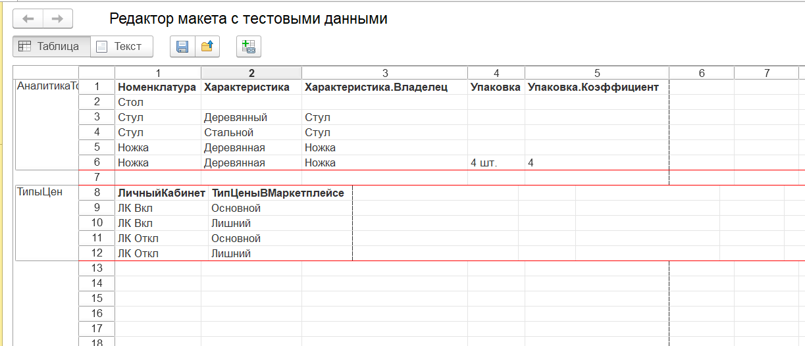
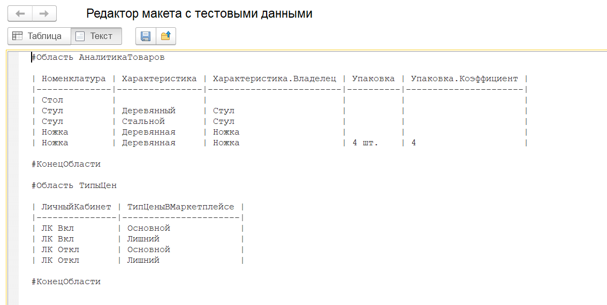

# Редактирование тестовых данных

## Предпосылки

При использовании макетов конфигурации для хранения тестовых данных,
каждый из двух доступных типов макета - табличный или текстовый документ -
имеет ряд своих плюсов и минусов.

Для табличного документа это:
- Удобное редактирование данных сразу в виде таблицы:
    - добавление и удаление строк и колонок в два клика мыши;
    - быстрое позиционирование на нужных ячейках для ввода данных;
    - установка ширины колонок под содержимое таблицы, наглядное разбиение макета на области.
- Однако:
    - при использовании git такой макет будет храниться либо в фиде "скобко-файла", либо в xml-формате
    что усложняе анализ истории изменения макета, слияние макета между ветками;
    - для работы с макетами в EDT и вовсе отсутствует какой-либо инструмент для сравнения-объединения
    табличных документов;
    - бонусом добавляются ошибки и зависания самой EDT при работе с табличным документом.

Markdown-таблицы данных в текстовых макетах имеют строго противоположные особенности:
- простота работы с макетами в git, простое слияние макетов, анализ истории изменения...
- но жутко неудобное редактирование самих таблиц, особенно при работе с несколькими таблицами в одном макете:
    - либо в результате будут невыровненные пробелами колонки таблиц;
    - либо разработчика ждет много рутинной работы по форматированию таблиц.

В итоге ради простоты хранения тестовых данных и удобства редактирования таблиц и был создан
собственный встроенный редактор.

## Возможности редактора

Редактор тестовых данных предоставляет следующий функционал:
- Выгрузка и загрузка табличного и текстового документов во внешний файл.
- Конвертация содержимого табличного документа в markdown-таблицы и обратно, при этом:
    - сохраняется разбиение данных по областям макета;
    - выравнивается ширина колонок по содержимому для обоих типов макета;

:::tip
Отсутствует дружественный к пользователю контроль ошибок ввода данных.
Например, неподдерживаемый ввод многострочного текста молча приведет к разрушению структуры markdown-таблицы.
:::

## Интерфейс

Ключевыми элементами редактора являются переключатель режима редактирования данных - Таблица или Текст -
а также в зависимости от положения переключателя поле ввода табличного либо текстового документа.

:::info
Всякий раз при переключении режима редактирования происходит конвертация данных из одного формата в другой.
:::

Предполагается следующий сценарий работы с редактором:
1. открывается редактор в режиме табличного документа;
1. вводятся все необходимые тестовые данные;
1. переключается режим на текстовый докуемент для конвертации данных;
1. посредством буфера обмена содержимое текстого поля копируется в макет конфигурации.

В случае, если редактируется уже существующий макет, то первым шагом добавляется
конвертация имеющихся markdown-таблиц и в табличный документ.
