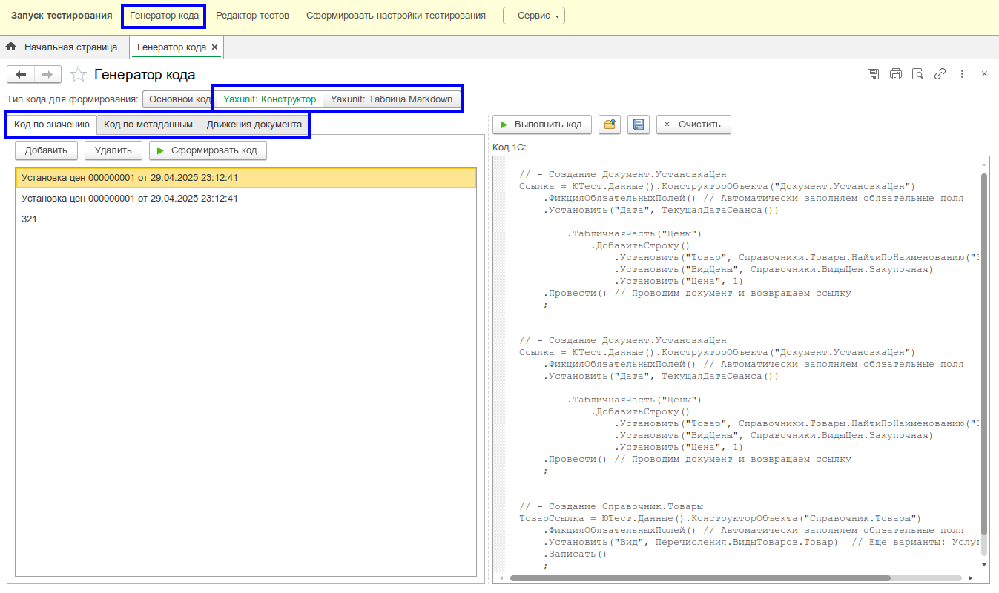

# Обработка: Генератор кода

Для возможности быстрой генерации данных используйте обработку автоматической генерации кода `Генератор кода`.

## Возможности

* Кодогенерация для создания справочника и документа.
* Создание движений документа
* Разные форматы вывода
  * `Yaxunit: Конструктор`
  * `Yaxunit: Таблица Markdown`

Обработка позволяет

* Быстро создавать необходимый набор тестовых данных, которые в дальнейшем можно использовать для написания тестов.
* Справится с проблемой "чистого листа", когда сложно начать - генерируем обработкой нужные данные, а потом дорабатываем получившийся код для использования в тестах (вынос в методы-конструкторы, удаление лишнего и тд).

Например: Требуется создать контрагента с наличием контактной информации (КИ). Если собирать это вручную, то займет очень много времени, т.к. много разных специализированных реквизитов КИ надо заполнить. Обработка позволит создать тут же по выбранной ссылке нужный код, который можем перенести в тест и там уже отредактировать.
