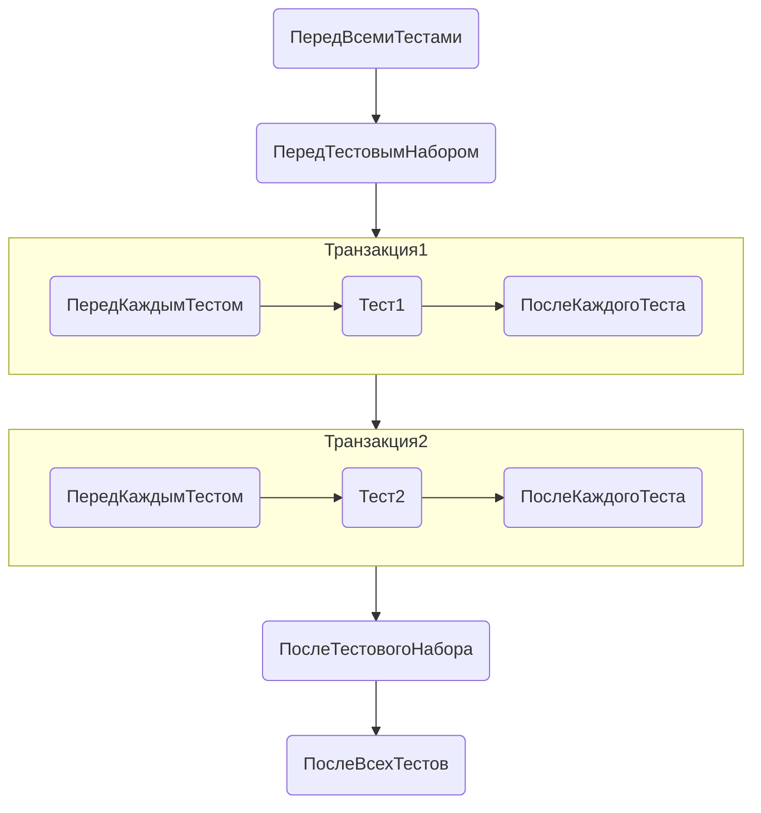
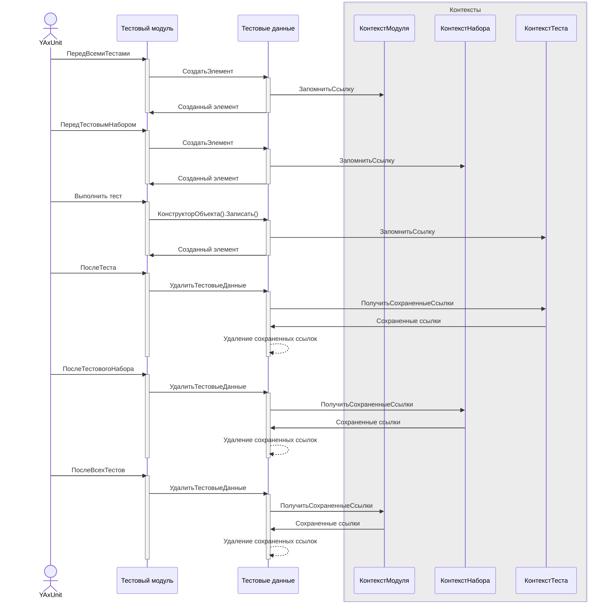

# Удаление тестовых данных

При использовании тестовых данных нередко необходимо удалять созданные объекты.

Для этого вы можете использовать

## Автоматические транзакции

Самый простой в способ отката изменений сделанных тестом - обернуть тест в транзакцию.  
Для того чтобы YAxUnit сам оборачивал тесты в транзакции вам, при регистрации теста, нужно вызвать метод [`ВТранзакции()`](/api/ЮТТесты#втранзакции).

* Если метод вызвать в самом начале, то настройка примениться для всех тестов модуля;
* если после добавления набора, то для всех тестов этого набора;
* если после добавления теста, то только для этого теста.
* Также можно отключать использование транзакции, указав параметр `ВТранзакции(Ложь)`

```bsl title=ВТранзакции.bsl
ЮТТесты
    .ДобавитьТест("Фикция").ВТранзакции() // Использование транзакции для конкретного теста

ЮТТесты
    .ДобавитьТестовыйНабор("Основной").ВТранзакции() // Использование транзакции для набора тестов
    .ДобавитьТест("Фикция")

ЮТТесты.ВТранзакции() // Использование транзакции для тестов модуля
    .ДобавитьТест("Фикция")
```

И тогда тестовый движок будет оборачивать в транзакцию **каждый серверный тест** (для клиентских будет игнорироваться)

Особенности работы:

* В транзакцию оборачивается только тест и [события](../events.md) `ПередКаждымТестом\ПередТестом` и `ПослеКаждогоТеста\ПослеТеста`
* Для клиентских тестов настройка игнорируется

### Схема работы транзакций

Для настройки

```bsl title='Тесты набора с настройкой ВТранзакции'
ЮТТесты
    .ДобавитьТестовыйНабор("Основной").ВТранзакции()
        .ДобавитьТест("Тест1")
        .ДобавитьТест("Тест2")
```

Схема выполнения будет выглядеть так:



Точно также она будет выглядеть и для настройки

```bsl
ЮТТесты.ВТранзакции()
    .ДобавитьТестовыйНабор("Основной")
        .ДобавитьТест("Тест1")
        .ДобавитьТест("Тест2")
```

:::caution Учитывайте
В транзакцию оборачивается тест, а не модуль или набор, поэтому данные созданные вне теста не будут удалены.
Такие данные необходимо удалять самостоятельно при необходимости.

Например, настройка

```bsl
ЮТТесты
    .ДобавитьТестовыйНабор("Основной").ВТранзакции() // Использование транзакции для набора тестов
```

указывает, что каждый тест набор будет выполняться в своей транзакции, которая будет отменена по окончании каждого теста.
:::

## Механизм удаления тестовых данных

В некоторых ситуация тестирование в транзакции невозможно:

* Клиентский тест
* Тестируемый метод не рассчитан на работу в транзакции (например, используются внутренние транзакции)
* Необходимо создавать данные за рамками теста (общие параметры)

В подобных случаях, для удаления созданных данных, может подойти механизм удаления тестовых данных.

Для его включения нужно при регистрации теста вызвать метод [`УдалениеТестовыхДанных()`](/api/ЮТТесты#удалениетестовыхданных).

:::caution Механизм имеет ряд ограничений и не работает для следующих кейсов:

* Данные созданы не через API
* Данные создаются внутри тестируемого кода
* Данные созданы в клиентском модуле через вызов своего серверного модуля, даже если он использует API тестового движка
:::

```bsl title=УдалениеТестовыхДанных.bsl
ЮТТесты
    .ДобавитьТест("Фикция").УдалениеТестовыхДанных() // Использование для конкретного теста

ЮТТесты
    .ДобавитьТестовыйНабор("Основной").УдалениеТестовыхДанных() // Использование для всех тестов набора
    .ДобавитьТест("Фикция")

ЮТТесты.УдалениеТестовыхДанных() // Использование для всех тестов модуля
    .ДобавитьТест("Фикция")

ЮТТесты.ВТранзакции().УдалениеТестовыхДанных() // Совместно с транзакцией
    .ДобавитьТест("Фикция")

```

Механизм не использует транзакции, а запоминает в контексте все созданные с помощью API объекты и записи регистров сведений.
Позволяет:

* Удалять данные созданные с клиента
* Удалять данные созданные вне теста (в обработчиках событий)

:::caution Удаление и только
Механизм только удаляет созданные объекты, изменения не откатываются
:::

:::tip Разное время жизни данных
Механизм понимает в рамках какого контекста исполнения (тест, набор, модуль) были созданы данные и удаляет их по выходу из него.
:::

Рассмотрим время жизни объектов созданных на разных этапах тестирования, например имеем такой модуль.

```bsl title=УдалениеТестовыхДанныхВремяЖизни.bsl
Процедура ПередВсемиТестами() Экспорт
    ДанныеМодуля = ЮТест.Данные().СоздатьЭлемент();
КонецПроцедуры

Процедура ПередТестовымНабором() Экспорт
    ДанныеНабора = ЮТест.Данные().СоздатьЭлемент();
КонецПроцедуры

Процедура ПослеВсехТестов() Экспорт
    ДанныеТеста = ЮТест.Данные().СоздатьЭлемент();
КонецПроцедуры

Процедура Тест() Экспорт
    Ссылка = ЮТест.Данные().СоздатьЭлемент();
КонецПроцедуры
```

Для переменных получим разное время жизни

* `ДанныеМодуля` - Живет, пока исполняются тесты модуля одного контекста (Сервер, Клиент).
* `ДанныеНабора` - Живет, пока исполняются тесты набора.
* `ДанныеТеста` и `Ссылка` -  Живут, пока исполняется тест.

### Схема работы механизма "УдалениеТестовыхДанных"



## Глобальная настройка удаления данных

Для глобальной настройки [`ВТранзакции()`](/api/ЮТТесты#втранзакции) и/или [`УдалениеТестовыхДанных()`](/api/ЮТТесты#удалениетестовыхданных) вам необходимо всего лишь создать свой общий модуль, подписать на событие инициализации и там установить глобальные настройки.

Подробнее тема будет раскрыта в будущем.
