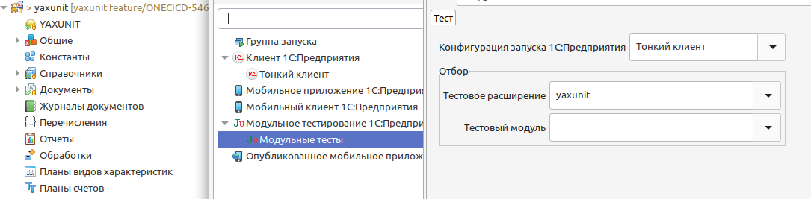
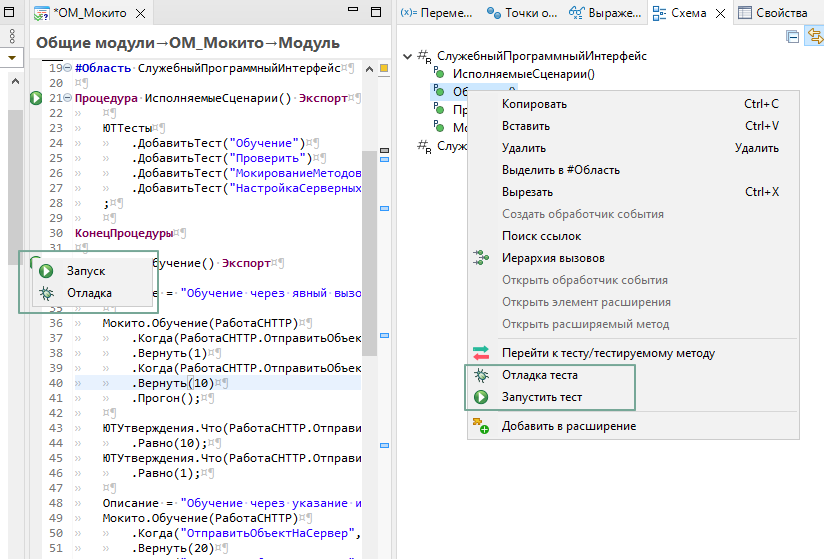
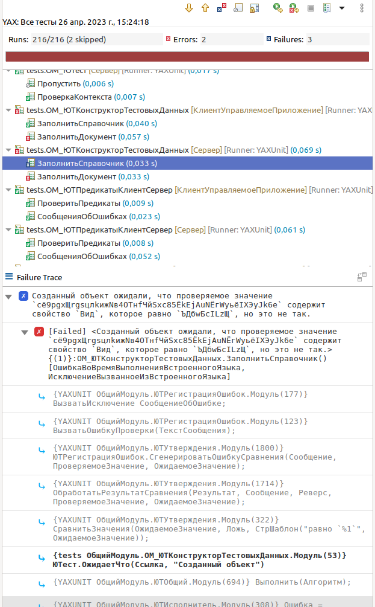
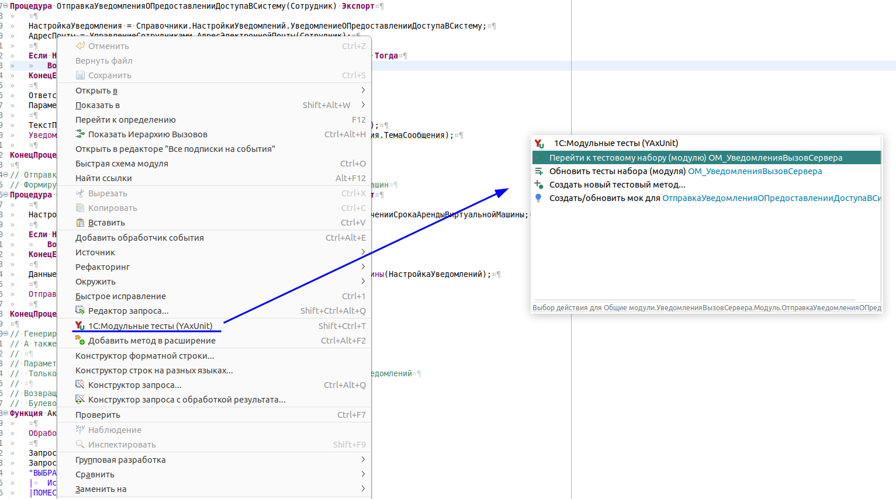

# Плагин для EDT

Предоставляет следующие функции

## Запуск тестов

В первую очередь, плагин предоставляет новую конфигурацию запуска, позволяя указать настройки запуска тестов.

После создания конфигурация запуска тестов, появляется возможность запустить выполнение тестов, используя стандартное меню EDT _(также как и 1С:Предприятие)_.

Кроме конфигурации запуска тестов, плагин добавляет команды запуска тестова для конкретных методов, а также тестовых модулей.  
Справа от имени каждого тестового метода появляется кнопка запуска, запускающая этот тест или все тесты модуля _(если выполнить запуск тестова для метода `ИсполняемыеСценарии`)_.  

Для удобства, эти команды продублированы в контекстное меню на панеле "Схема модуля".

## Отчет о тестировании

По окончании тестирования плагин выводит отчет в котором детально отображается список пройденных тестов, статус их прохождения и информация о возникших ошибках.

Отчет позволяет:

* Получить информацию о результате тестирования;
* Перезапустить тесты _(упавшие, все или выбранные)_;
* Посмотреть историю тестовых прогонов;
* Перейти к тесту и тестируемому методу;
* Просмотреть стек ошибки и перейти к месту их возникновения;
* Увидеть различие ожидаемого и фактического значения.

## Команды помощники

Для помощи при написании тестов добавлена команда "1С:Модульные тесты (YAxUnit)" в контекстное меню редактора и схемы модуля. Она позволяет:

* создавать тестовые методы,
* генерировать наборы тестов,
* создавать моки,
* переходить между проверяемым методом и тестом,
* а также запускать тесты.

При выборе этой команды открывается окно с доступными действиями. Список действий формируется динамически и зависит от модуля.

Для модулей конфигурации доступны действия создания тестов и моков, а также переходы к тестам при их наличии.

Для модулей с тестами - команды создания тестов и их запуска.

Для того, чтобы движок мог находить тестовые модули, выполнять переходы между ними, вы должны следовать [схеме наименования](../structure.md)

