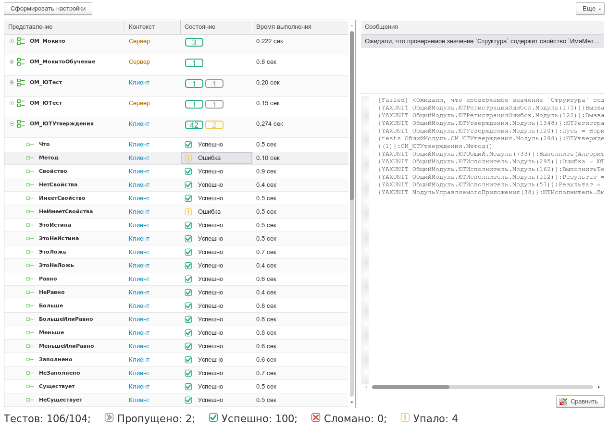

# Начало работы

YAxUnit - это расширение конфигурации с открытым исходным кодом, которое помогает в нелегком труде по написанию модульных тестов для решений на платформе 1С:Предприятие.

Прежде всего нужно пройти через [процесс установки](install/).

После этого вы можете попробовать написать свой [первый тест](first-test.md) или ознакомиться с возможностями YAxUnit изучив [руководство](../features/).

## Системные требования

|                                       |                         |
|--------------------------------------:|-------------------------|
|       Версия платформы 1С:Предприятие | `8.3.10+`               |
|                     Поддерживаемые ОС | `Windows`, `Linux`      |
|             Вариант встроенного языка | `Русский`, `Английский` |
|         Поддерживаемые режимы работы: |                         |
|                         Тонкий клиент | ✅                       |
|                         Тонкий клиент | ✅                       |
| Толстый клиент управляемое приложение | ✅                       |
|     Толстый клиент обычное приложение | ✅                       |
|                            Web-клиент | ❌                       |
|          Файловая информационная база | ✅                       |
|  Клиент-серверная информационная база | ✅                       |
