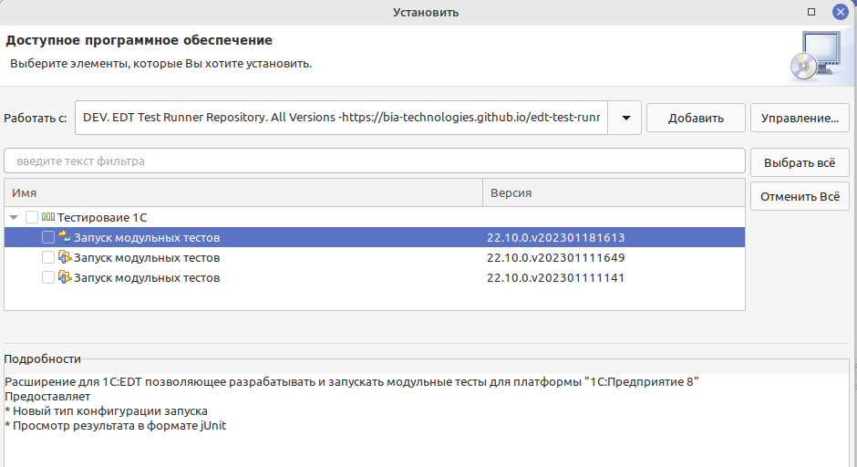

# Установка плагина для работы с тестами

```mdx-code-block
import Tabs from '@theme/Tabs';

import TabItem from '@theme/TabItem';
```

Для того, что бы вам и нам было проще писать тесты мы разработали плагин для 1С:Enterprise Development Tools (EDT).

С его помощью вы сможете:

* Запускать и отлаживать свои тесты;
* Просматривать результаты выполнения.
* И [что-то еще](https://github.com/bia-technologies/edt-test-runner/blob/develop/docs/%D0%A4%D1%83%D0%BD%D0%BA%D1%86%D0%B8%D0%B8.md)

Для установки плагина вам необходимо воспользоваться стандартным функционалом Eclipse (EDT) `Установить новое ПО...`.

* Открываем EDT.
* Переходим к `Установить новое ПО` (в меню `Справка`);
* Добавляем новый репозиторий;

````mdx-code-block
<Tabs>
  <TabItem value="master" label="Основной репозиторий">
  ```url
  https://bia-technologies.github.io/edt-test-runner/repository
  ```
  </TabItem>
  <TabItem value="develop" label="Develop">
  ```url
  https://bia-technologies.github.io/edt-test-runner/dev/repository
  ```
  </TabItem>
  <TabItem value="old-2023-02" label="Для версий EDT до 2023-02">
  ```url
  https://bia-technologies.github.io/edt-test-runner/repository/updates/23.x
  ```
  </TabItem>
</Tabs>
````

  

  :::tip совет
  Для ускорения установки можно убрать галочку `Обращаться во время инсталляции ко всем сайтам ...`
  :::

* Нажимаем далее;
* Принимаем лицензию;
* Соглашаемся с предупреждением безопасности;
* И перезагружаем IDE.
  :::note примечание
  EDT будет долго перезагружаться и это нормально.
  :::
