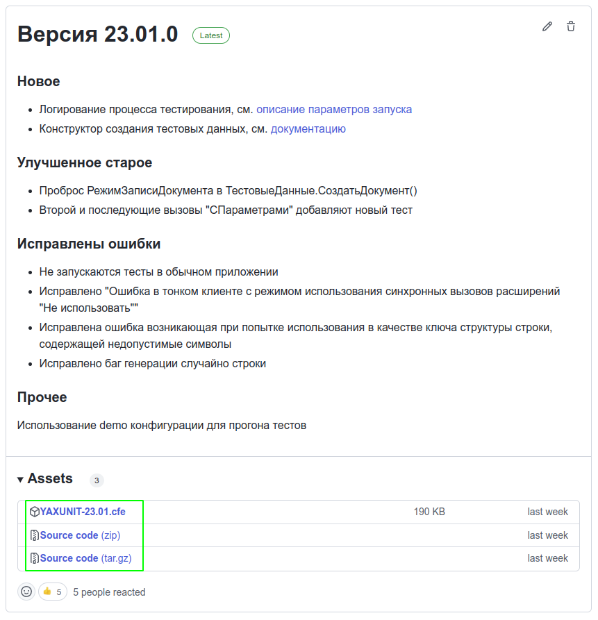
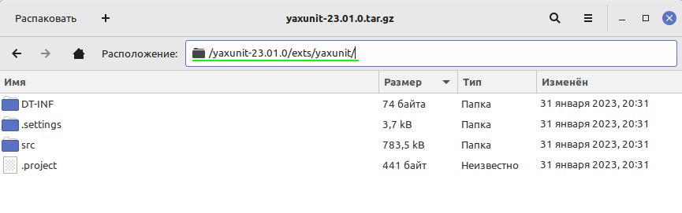

# Установка

YAxUnit - это расширение для 1С:Предприятия, которое необходимо добавить к вашему проекту.

## Требования

* 1С:Предприятие версии 8.3.10 или старше

## Установка в 1С:Enterprise Development Tools (EDT)

### Первичная установка тестового движка в рабочее пространство (workspace)

1. Скачаем архив [релиза](https://github.com/bia-technologies/yaxunit/releases/latest)
   

2. Копируем из архива расширение расположенное в каталоге `exts/yaxunit/` в свой каталог с исходниками (не в workspace)
   
3. Импортируем проект расширения в workspace
   
4. Привязываем импортированный проект расширения к конфигурации
   
5. Обновляем конфигурацию
6. В конфигураторе снимаем с расширения **безопасный режим** и **защиту от опасных действий**
7. Готово, можно приступить к написанию тестов.

   :::tip совет
   Для удобства разработки тестов рекомендуется [установить плагин](install-plugin.md)
   :::

### Обновление тестового движка

1. Скачаем архив [релиза](https://github.com/bia-technologies/yaxunit/releases/latest)
2. Если вы дорабатывали движок, то скачиваем архив оригинальной установленной версии движка
3. Разархивируем их во временный каталог
4. Воспользуемся механизмом сравнения объединения EDT
    
   * Второй источник - каталог к новой версии тестового движка
   * Использование третьего источника нужно для трехстороннего сравнения и применяется при доработках движка.
5. Нажимаем "Объединить"
6. Готово.

## Установка в конфигуратор

1. Скачаем расширение (cfe) [релиза](https://github.com/bia-technologies/yaxunit/releases/latest)
      
2. Загружаем в конфигуратор
3. Снимаем с расширения **безопасный режим** и **защиту от опасных действий**
4. Готово
