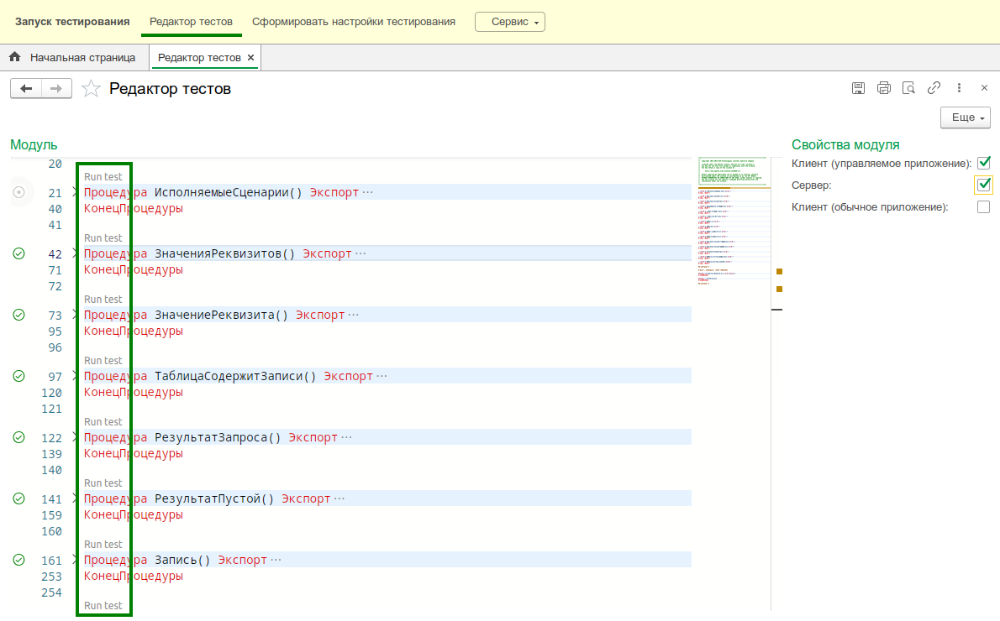

# Запуск и отладка тестов

В общем случае запуск тестов выполняется запуском 1С:Предприятия с параметром `RunUnitTests`. При необходимости можно указать путь к файлу [конфигурации запуска](configuration.md) для настройки прогона тестов.

Для упрощения запуска существуют другие способы.

:::caution Важно
После загрузки расширения в информационную базу необходимо отключить у него **безопасный режим** и **защиту от опасных действий**.
:::

## Запуск из 1С:Enterprise Development Tools (1С:EDT)

Если вы используете 1С:EDT, то, установив [плагин](../install/install-plugin.md), вы получаете возможность запускать тесты нажатием одной кнопки.

:::info
Все описанные ниже способы позволяют запускать тесты в режиме отладки.
:::

### Конфигурация запуска

Плагин добавляет в 1С:EDT новый тип конфигурации запуска приложения.

С ее помощью вы можете запускать тесты так же, как и 1С:Предприятие (кнопкой на панели инструментов).

:::caution Важно
Без созданной и настроенной конфигурации запуска модульных тестов не будут работать другие варианты запуска.
:::

### Запуск из боковой панели модуля

Плагин также позволяет запускать тесты прямо из модуля для нужных методов.
Если вы перейдете в модуль с тестами, то рядом с каждым тестовым методом вы увидите иконки запуска.

Кликнув по ним, вы сможете запустить конкретный тест.
При нажатии на иконку метода `ИсполняемыеСценарии` вы запустите все тесты модуля.

Команды запуска добавлены в схему модуля.

### Запуск из палитры команд

Плагин добавляет набор различных команд для работы с тестами, среди которых есть и запуск.

Основным плюсом является возможность работать с клавиатуры, не запоминая большое количество горячих клавиш.
Нажмите `Ctrl+Shift+T`, затем `Enter`, и тест текущего метода будет запущен.

### Запуск без перезапуска 1С:Предприятия

:::tip С версии `25.01`
Функциональность доступа начиная с версии  `25.01` тестового движка YAxUnit и плагина для 1С:EDT
:::

Для ускорения процесса отладки тестов предусмотрен вариант запуска тестов в уже запущенном 1С:Предприятие.

Для включения этого режима необходимо активировать опцию **"Запуск тестов без перезапуска"** в конфигурации запуска.

После настройки запустите любой тест. 1С:Предприятие не закроется после завершения тестирования и будет готово принимать команды от 1С:EDT.
Все последующие запуски тестов будут выполняться в уже запущенном предприятии.

:::caution Важно
В 1С:Предприятие передается **только текст тестового модуля**. Изменения в других модулях или конфигурации не учитываются.

Чтобы применить такие изменения, необходимо закрыть и перезапустить 1С:Предприятие.
:::

## Запуск из конфигуратора

Возможности конфигуратора ограничены, поэтому есть только один способ запустить тесты:

1. Создать файл конфигурации запуска:
   * [Вручную](configuration.md)
   * С помощью [формы настройки](../../yaxunit-ui.md#интерфейс-настройки-конфигурации)
2. Указать путь к файлу конфигурации запуска в параметрах запуска.

   

:::tip
При разработке или отладке тестов полезно держать открытой [форму настройки](../../yaxunit-ui.md#интерфейс-настройки-конфигурации) для быстрой перенастройки запускаемых тестов. Сначала запустите тесты модуля, затем в той же форме исключите "зеленые" тесты, сохраните настройку в тот же файл и выполните отладку нужных тестов, запустив их из конфигуратора.
:::

## Запуск из 1С:Предприятие

Для запуска тестов из предприятия необходимо воспользоваться командой [Запуск тестирования](../../yaxunit-ui.md#запуск-тестов).

## Запуск из редактора в 1С:Предприятие

Для ускорения разработки тестов добавлен [редактор тестов](https://github.com/alkoleft/yaxunit-editor), который позволяет писать и запускать тесты в 1С:Предприятие.

:::note Требования

* Windows - 1C:Предприятие 8.3.14+
* Linux - 1C:Предприятие 8.3.24+

:::

## Строка запуска предприятия

`[путь к клиенту 1С] ENTERPRISE [Параметры подключения к ИБ] [Параметры авторизации] /C RunUnitTests=/путь/к/конфигурационному/файлу`

Для формирования строки запуска можно воспользоваться [интерфейсом настройки](../../yaxunit-ui.md#интерфейс-настройки-конфигурации).

Пример:

`"C:\Program Files\1cv8\8.3.18.1698\bin\1cv8c.exe" ENTERPRISE /IBName MyInfoBase /N Admin /C RunUnitTests=C:\tmp\test-config.json`

Запуск тестов в режиме тонкого клиента на информационной базе `MyInfoBase` под пользователем `Admin` по конфигурации, указанной в файле `C:\tmp\test-config.json`.
