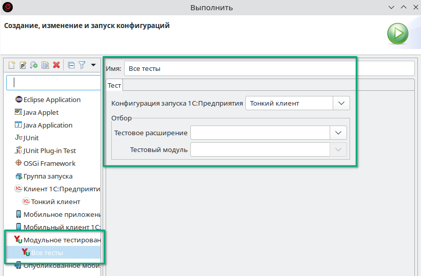
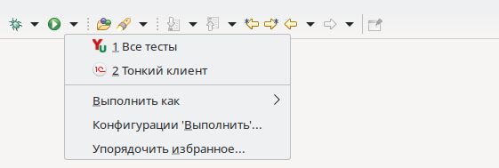
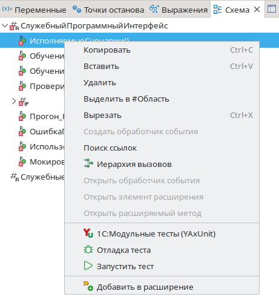
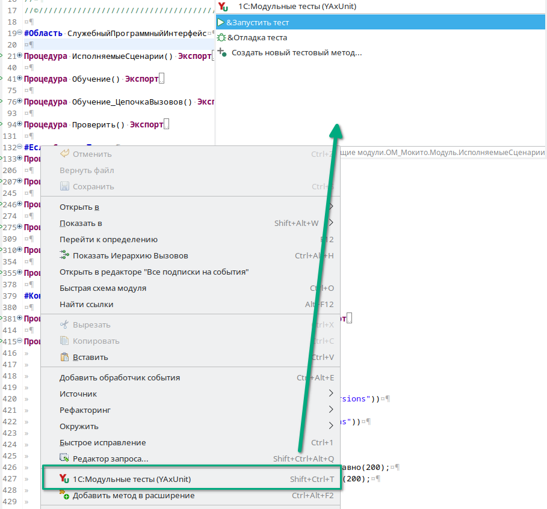
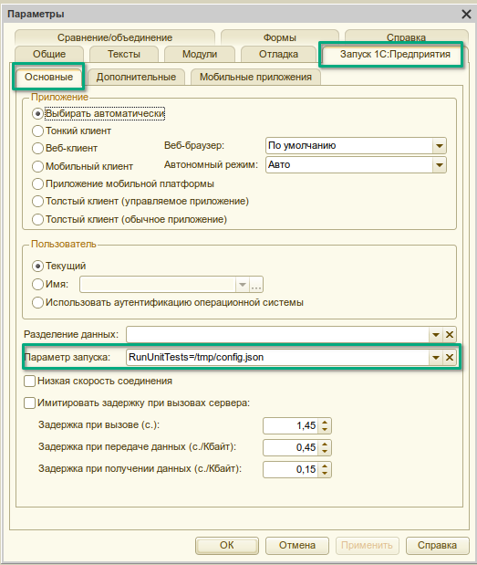
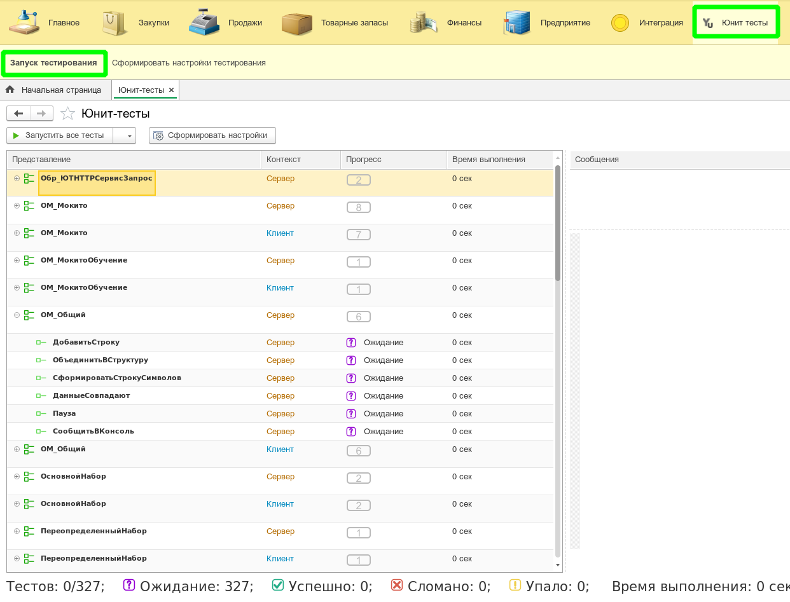

# Запуск и отладка тестов

В общем случае запуск тестов выполняется запуском 1С:Предприятия с параметром `RunUnitTests`. При необходимости можно указать путь к файлу [конфигурации запуска](configuration.md) для настройки прогона тестов.

Для упрощения этого процесса есть другие способы.

:::caution Важно
*После загрузки расширения в информационную базу необходимо отключить у него `безопасный режим` и `защиту от опасных действий`*
:::

## Запуск из 1С:Enterprise Development Tools (EDT)

Если вы используете EDT, то установив [плагин](../install/install-plugin.md) вы получаете возможность запускать тесты нажатием одной кнопки.

:::info
Все описанные ниже способы позволяют запускать тесты в режиме отладки
:::

### Конфигурация запуска

Плагин добавляет в EDT новый тип конфигурации запуска приложения.

С ее помощью вы можете запускать тесты также как и 1С:Предприятие (кнопкой панели инструментов)

:::caution Важно
Без созданной и настроенной конфигурации запуска модульных тестов не будут работать другие варианты запуска.
:::

### Запуск из боковой панели модуля

Также плагин позволяет запускать тесты прямо из модуля для нужных методов.  
Если вы перейдете в модуль с тестами, то рядом с каждым тестовым методом вы увидите иконки запуска.

Кликнув по ним вы сможете запустить конкретный тест.  
При нажатии на иконку метода `ИсполняемыеСценарии` вы запустите все тесты модуля.

Команды запуска добавлены в схему модуля.

### Запуск из палитры команд

Плагин добавляет набор различных команд для работы с тестами, среди которых есть и запуск.

Основным ее плюсом является возможность работать с клавиатуры и не запоминать большое количество горячих клавиш.
`Ctrl+Shift+T`, затем `Enter` и тест текущего метода запущен.

## Запуск из конфигуратора

Возможности конфигуратора не столь большие, поэтому есть только один способ запустить тесты.

1. Создать файл конфигурации запуска
   * [Вручную](configuration.md)
   * С помощью [формы настройки](../../yaxunit-ui.md#интерфейс-настройки-конфигурации)
2. Указать путь к файлу конфигурации запуска в параметрах запуска

   

:::tip
При разработки/отладке тестов полезно держать открытой [форму настройки](../../yaxunit-ui.md#интерфейс-настройки-конфигурации) для быстрой перенастройки запускаемых тестов. Сначала запустил тесты модуля, потом в той же форме убрали "зеленые", сохранили настройку в тот же файл и выполнили отладку нужных тестов, запустив их из конфигуратор.
:::

## Запуск из предприятия

Для запуска тестов из предприятия необходимо воспользоваться командой [Запуск тестирования](../../yaxunit-ui.md#запуск-тестов)

## Строка запуска предприятия

`[путь к клиенту 1С] ENTERPRISE [Параметры подключения к ИБ] [Параметры авторизации] /C RunUnitTests=/путь/к/конфигурационному/файлу`

Для формирования строки запуска можно воспользоваться [интерфейсом настройки](../../yaxunit-ui.md#интерфейс-настройки-конфигурации)

Пример:

`"C:\Program Files\1cv8\8.3.18.1698\bin\1cv8c.exe" ENTERPRISE /IBName MyInfoBase /N Admin /C RunUnitTests=C:\tmp\test-config.json`
  Запуск тестов в режиме тонкого клиента на информационной базе `MyInfoBase` под пользователем `Admin` по конфигурации указанной в файле `C:\tmp\test-config.json`
