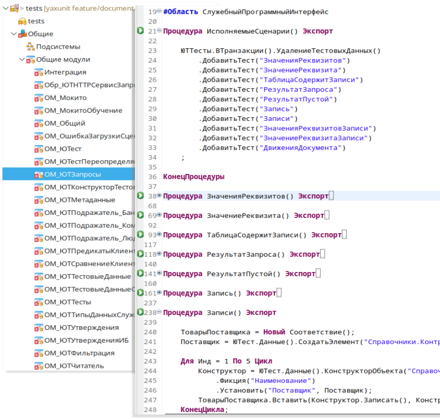

# Организация тестов

## Расширение с тестами

Тесты размещаются в расширениях конфигурации, вы можете их совместить с движком, либо создать отдельное расширение.

* Вместе с движком.
  * Доступна контекстная подсказка.
  * Сложнее обновлять движок, необходимо воспользоваться сравнением-объединением.
* В отдельном расширении.
  * Нет подсказки по методам движка.
  * Движок обновляется загрузкой/заменой.
  * Проще переключаться между версиями.
  * Движок можно не хранить в репозитории проекта.

Мы в своих проектах используем первый вариант, так как удобство и экономия времени каждым разработчиком от контекстной подсказки перевешивает минус ручного обновления.

## Тестовые модули

Тесты располагаются в общих модулях (не заимствованных).
Тестовые модули (наборы тестов объекта) состоят из следующих блоков:

* Метод регистрации тестов `ИсполняемыеСценарии`.
  В методе регистрации необходимо [перечислить все тесты](../features/test-registration.md) и, при необходимости, выполнить настройку.
* Реализация тестов, тестовые методы, собственно сами тесты.
* [Обработчики событий](../features/events.md), при необходимости.

Принято на один тестируемый модуль объекта создавать один общий модуль с тестами, например, тесты на модуль объекта и отдельно тесты на модуль менеджера.

Также полезно использовать регламент наименования тестовых модулей, так чтобы вам проще было с ними работать в будущем, облегчить навигацию.

Рекомендуем рассмотреть схему именования для EDT и если ее соблюдать, вы сможете с легкостью переключатся между тестом и тестируемым методом.

### Схема наименования модулей

Все тесты должны располагаться в общих модулях.

Имя тестового модуля должно соответствовать шаблону `[Префикс типа объекта_][Имя проверяемого объект]{_Суффикс типа модуля}`, где суффикс не обязателен, но крайне желателен.

По правильно названному модулю мы можем с легкостью получить информацию о типе тестируемого объекта и его имени, а также тип его модуля, методы которого проверяем. Список поддерживаемых суффиксов и префиксов приведен в таблицах ниже.

#### Префиксы типов объекта

| Тип тестируемого объекта | Префикс | Пример                                      |
| ------------------------ | ------- | ------------------------------------------- |
| Общий модуль             | `ОМ_`     | ОМ_ОбщегоНазначения                         |
| Регистр бухгалтерии      | `РБ_`     | РБ_Хозрасчетный, РБ_Хозрасчетный_НЗ         |
| Регистр накопления       | `РН_`     | РН_ОстаткиНаСкладах, РН_ОстаткиНаСкладах_ММ |
| Регистр расчета          | `РР_`     | РР_Зарплата, РР_Зарплата_НЗ                 |
| Регистр сведений         | `РС_`     | РС_АдресныйКлассификатор                    |
| Бизнес процесс           | `БП_`     | БП_Согласование                             |
| Справочник               | `Спр_`    | Спр_Пользователи, Спр_Пользователи_МО       |
| План счетов              | `ПС_`     | ПС_Хозрасчетный                             |
| План видов расчета       | `ПВР_`    | ПВР_Зарплатный                              |
| План видов характеристик | `ПВХ_`    | ПВХ_Субконто, ПВХ_Субконто_ММ               |
| Документ                 | `Док_`    | Док_ПКО                                     |
| Перечисление             | `Пер_`    | Пер_СтатусСогласования                      |
| План обмена              | `ПО_`     | ПО_РИБ, ПО_РИБ_ММ                           |
| Задача                   | `Зад_`    | Зад_Задача                                  |
| Обработка                | `Обр_`    | Обр_ЗакрытиеМесяца, Обр_ЗакрытиеМесяца_МО   |
| Отчет                    | `Отч_`    | Отч_УниверсальныйОтчет                      |

#### Суффиксы типов модулей

| Тип тестируемого модуля | Суффикс        | Пример                                     |
| ----------------------- | -------------- | ------------------------------------------ |
| Общий модуль            | `<Без суффикса>` | ОМ_ОбщегоНазначения                        |
| Модуль объекта          | `_МО`            | Спр_Пользователи_МО, Обр_ЗакрытиеМесяца_МО |
| Модуль менеджера        | `_ММ`            | ПВХ_Субконто_ММ, ПО_РИБ_ММ                 |
| Модуль набора записей   | `_НЗ`            | РБ_Хозрасчетный_НЗ, РР_Зарплата_НЗ         |

## Тестовые методы

Тест состоит из двух обязательных частей:

* Регистрация в методе `ИсполняемыеСценарии`
* Реализация теста.
