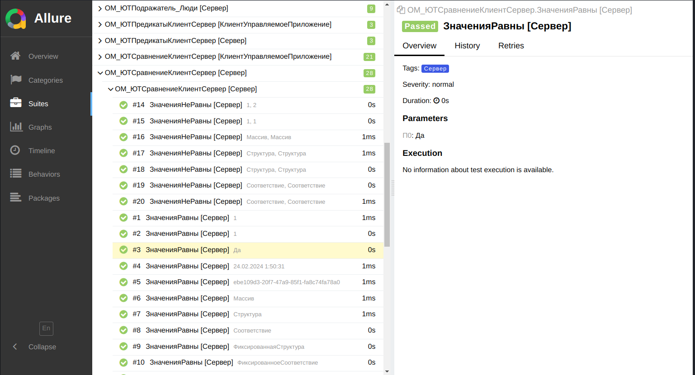

# Форматы отчетов о тестировании

YAxUnit поддерживает генерацию отчетов в форматах `JUnit` и `Allure`.

Указать необходимый формат вы может в [параметрах запуска](run/configuration), либо в [форме настроек](yaxunit-ui#интерфейс-настройки-конфигурации).
По умолчанию используется формат `JUnit`.

## Формат `JUnit`

Широко распространенный формат отчетов о тестировании. Используется для интеграции с [плагином запуска тестов из EDT](https://github.com/bia-technologies/edt-test-runner). В отличии от Allure позволяет хранить и сравнивать ожидаемое и фактическое значения. Подходит для процесса разработки/отладки тестов.

## Формат `Allure`

Чаще применяется в CI как более универсальный и удобный способ организации отчетов о тестировании. Позволяет добавлять различную мета информацию, которая будет отображаться в отчете, имеет различные способы группировки, историю запусков и многое другое.

Группировка по тестовым наборам

Группировка по функциональности

