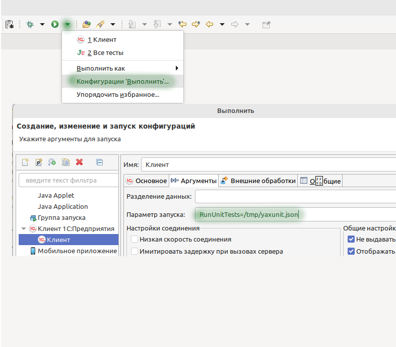
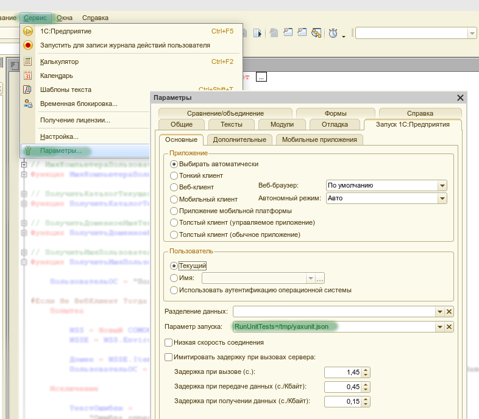

# Запуск

Для запуска тестов необходимо запустить 1С:Предприятие с параметром `RunUnitTests`, при необходимости можно указать путь к файлу [конфигурации запуска](configuration.md).

:::caution Важно
*После загрузки расширения в информационную базу необходимо отключить у него `безопасный режим` и `защиту от опасных действий`*
:::

## Запуск из EDT

Для запуска тестов из EDT необходимо установить [плагин](../install/install-plugin.md), либо вручную создать файл [конфигурации запуска](configuration.md) и указать его в параметрах запуска.

## Запуск из конфигуратора

Для запуска тестов из конфигуратора вы можете

* Вручную создать файл [конфигурации запуска](configuration.md) и указать его в параметрах запуска
  
* Воспользоваться [интерфейсом настройки](../yaxunit-ui.md#интерфейс-настройки-конфигурации)

## Запуск из предприятия

Для запуска тестов из предприятия необходимо воспользоваться командой [Запуск тестирования](../yaxunit-ui.md#запуск-тестов)

## Строка запуска предприятия

`[путь к клиенту 1С] ENTERPRISE [Параметры подключения к ИБ] [Параметры авторизации] /C RunUnitTests=/путь/к/конфигурационному/файлу`

Для формирования строки запуска можно воспользоваться [интерфейсом настройки](../yaxunit-ui.md#интерфейс-настройки-конфигурации)

Пример:

`"C:\Program Files\1cv8\8.3.18.1698\bin\1cv8c.exe" ENTERPRISE /IBName MyInfoBase /N Admin /C RunUnitTests=C:\tmp\test-config.json`
  Запуск тестов в режиме тонкого клиента на информационной базе `MyInfoBase` под пользователем `Admin` по конфигурации указанной в файле `C:\tmp\test-config.json`
