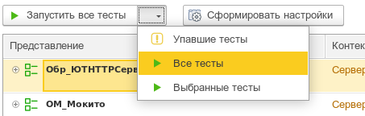
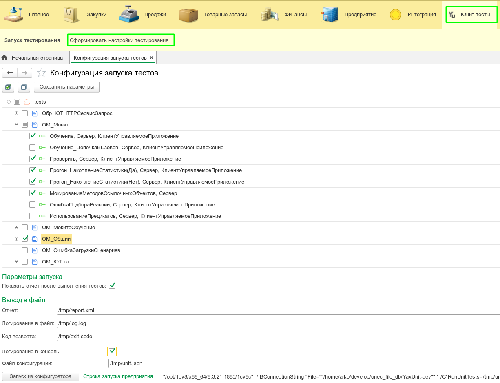

# Графический интерфейс

Расширение добавляет в командный интерфейс конфигурации новый раздел `YAxUnit`.

Из него вы можете интерактивно запускать тесты или сформировать файл конфигурации запуска.

## Запуск тестов

Для запуска и отладки тестов вы можете воспользоваться командой `Запуск тестирования`.

Будут автоматически загружены все тесты и выведены в виде дерева сгруппированного по тестовым наборам (модулям).

Из этой формы вы можете запустить нужные тесты.

И сразу же увидеть результат прогона.

## Интерфейс отчета

## Интерфейс настройки конфигурации

Для облегчения создания конфигурации реализована форма конфигурирования.
Чтобы найти форму, перейдите в раздел `YAxUnit` и воспользуйтесь командой `Сформировать настройки тестирования`. 
Также можно воспользоваться меню `Все функции` / `Функции для технического специалиста`, там найдете обработку `Юнит-тесты`, из которой, воспользовавшись командой `Сформировать настройки` попадете в интерфейс конфигурирования.

Позволяет указать запускаемые тесты и получить строку запуска из терминала и параметры для конфигуратора.

