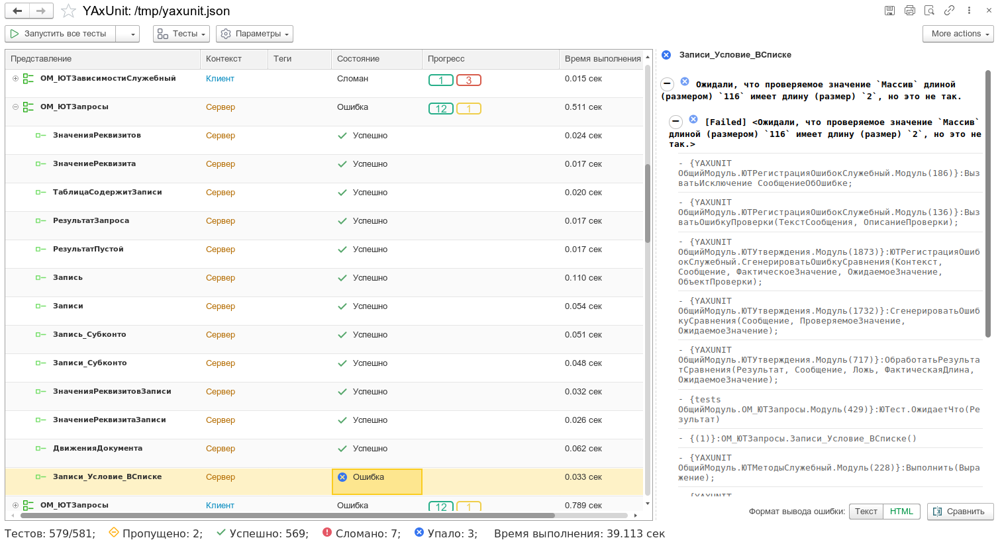

# Графический интерфейс

## Интерфейс отчета

Для просмотра результатов тестирования в режиме 1С:Предприятие, вам необходимо в параметрах запуска указать [настройку](run) `showReport`
Например, создав файла настроек

```json
{
    "reportPath": "/tmp/settings/",
    "filter": {
        "extensions": [
            "tests"
        ]
    },
    "settings": {
        "ВТранзакции": false
    },
    "reportFormat": "jUnit",
    "showReport": true
}
```

Мы получим примерно такой результат



## Интерфейс настройки конфигурации

Для облегчения создания конфигурации реализована форма конфигурирования.
Чтобы найти форму, перейдите в подсистему `Юнит тесты` или воспользуйтесь меню `Все функции` / `Функции для технического специалиста`.
Там найдете обработку `Юнит тесты`, из которой, воспользовавшись командой `Сформировать настройки` попадете в интерфейс конфигурирования


Позволяет указать запускаемые тесты и получить строку запуска из терминала и параметры для конфигуратора


