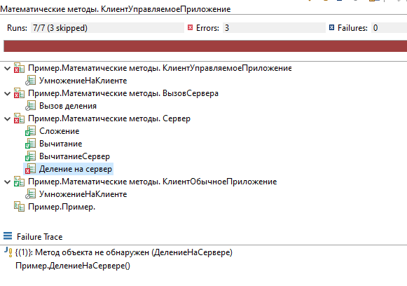

# YAXUnit. Расширение для запуска тестов

----

[](https://github.com/bia-technologies/yaxunit/actions)
[](https://github.com/bia-technologies/yaxunit/releases/latest)
[](https://github.com/bia-technologies/yaxunit/releases)
[](https://sonar.openbsl.ru/dashboard?id=yaxunit)
[](https://sonar.openbsl.ru/dashboard?id=yaxunit)

[](https://github.com/bia-technologies/yaxunit/actions/workflows/main-build.yml)
[](https://github.com/bia-technologies/yaxunit/actions/workflows/deploy-documentation.yml)

Обсудить в [Telegram чате](https://t.me/BIAOpenTools/12)

----

- [YAXUnit. Расширение для запуска тестов](#yaxunit-расширение-для-запуска-тестов)
  - [Назначение](#назначение)
    - [Возможности](#возможности)
  - [Пример тестового модуля](#пример-тестового-модуля)
  - [Запуск](#запуск)
    - [Запуск из EDT](#запуск-из-edt)
    - [Запуск вне EDT](#запуск-вне-edt)
  - [Благодарности](#благодарности)
  - [Лицензия](#лицензия)

## Назначение

Самостоятельное расширение для написания и выполнения модульного тестирования.

### Возможности

- YAXUnit - это расширение с открытым исходным кодом, которое используется для написания и выполнения тестов
- Разрабатывалось с оглядкой на JUnit5, пожалуй, лучший фреймворк тестирования
- Предоставляет движок выполнения тестов
- Предоставляет утверждения для проверки ожидаемых результатов
- Тесты могут быть организованы в наборы и выполняться в разных контекстах
- Позволяет быстрее и проще не только писать, но и читать тесты
- Результаты тестирования могут быть сохранены в отчет, на текущий момент jUnit и json.
- Большая часть пользовательского API реализована как [текучие выражения](https://ru.wikipedia.org/wiki/Fluent_interface)
- Предусмотрена возможность расширения функциональности, можно регистрировать свои форматы отчетов, добавлять модули с утверждениями
- Реализован [плагин для EDT](https://github.com/bia-technologies/edt-test-runner), который упрощает процесс запуска тестов

Подробнее ознакомиться с функциональностью вы можете изучив [документацию](/docs/user-api).

А для того, что бы начать писать тесты необходимо [установить расширение](/docs/install) в свою IDE (конфигуратор или EDT).

## Пример тестового модуля

Для создания теста нужно в расширении (в отдельном или в том же) добавить модуль, содержащий экспортный метод регистрации - `ИсполняемыеСценарии` и реализовать тесты.

Пример модуля тестов:

```bsl
#Область СлужебныйПрограммныйИнтерфейс

Процедура ИсполняемыеСценарии() Экспорт
    
    // Регистрация тестов
    ЮТТесты // Регистрация тестов выполняет через модуль регистратор
        .ДобавитьТестовыйНабор("Математические методы")               // Набор - объединение тестов
            .ДобавитьТест("Сложение")                                 // Обязательно при регистрации указываем имя экспортного метода
            .ДобавитьТест("Вычитание", "Вычитание")                   // Также можно указать представление теста
            .ДобавитьТест("Вычитание", "ВычитаниеСервер", , "Сервер") // Контекст исполнения, по умолчанию тест выполняется во всех контекстах модуля
            .ДобавитьКлиентскийТест("УмножениеНаКлиенте")                   // Есть отдельный метод для регистрации клиентских тестов
            .ДобавитьСерверныйТест("ДелениеНаСервере", "Деление на сервер") // Есть отдельный метод для регистрации серверных тестов
        .ДобавитьТестовыйНабор("Строковые методы")
            .ДобавитьТест("СтрНайти")
            .ДобавитьТест("СтрРазделить");

КонецПроцедуры

#КонецОбласти

#Область Тесты

Процедура Сложение() Экспорт

    // Реализация теста на сложение
    ЮТест.ОжидаетЧто(2 + 3, "2 + 3") // Используя модуль утверждений установим проверяемое значение и пояснение
        .ИмеетТип("Число") // Проверим тип
        .Заполнено() // Заполненность проверяемого значения
        .Больше(0) // Сравним с нулем
        .Равно(5); // Проверим ожидаемый результат

    ЮТест.ОжидаетЧто(-8 + 8, "-8 + 8") // Проверим второй вариант
        .Равно(0);

КонецПроцедуры

Процедура Вычитание() Экспорт

    // Реализация теста на вычитание
    ЮТест.ОжидаетЧто(2 - 3, "2 - 3").ИмеетТип("Число").Заполнено().Меньше(0);

КонецПроцедуры

#КонецОбласти

#Область События

// Также в тесте можно обрабатывать события выполнения
// Например можно реализовать подготовку и удаление тестовых данных
// Зачистку временных файлов, настройку системы

Процедура ПередВсемиТестами() Экспорт
    // Выполняется перед запуском всех тестов контекста, те если есть тесты и на клиенте и на сервер, то метод будет выполнен 2 раза
    Сообщить("Запуск тестирования");

КонецПроцедуры

Процедура ПередТестовымНабором() Экспорт

    // Выполняется перед каждым тестовым набором для каждого контекста выполнения
    Контекст = ЮТест.КонтекстТестовогоНабора(); // Контекст набора служит для хранения любых данных, нужных при тестировании
                                                // Контекст живет в рамках контекста выполнения, 
                                                // таки образом, через контекст нельзя передавать данные между серверными и клиентскими тестами
    Контекст.Вставить("ВремяНачала", ТекущаяУниверсальнаяДатаВМиллисекундах());

КонецПроцедуры

Процедура ПередКаждымТестом() Экспорт

    // Выполняется перед каждым тестом
    Контекст = ЮТест.КонтекстТеста(); // Контекст теста служит для хранения любых данных, нужных при тестировании
                                      // Контекст создает перед тестом и уничтожается после его выполнения
                                      // В контекст например, можно помещать созданные в процессе данные, что бы потом их удалить
    Контекст.Вставить("ВремяНачала", ТекущаяУниверсальнаяДатаВМиллисекундах());

КонецПроцедуры

Процедура ПослеКаждогоТеста() Экспорт

    // Выполняется после каждого теста
    Контекст = ЮТест.КонтекстТеста();
    Сообщить("Время выполнения теста: " + (ТекущаяУниверсальнаяДатаВМиллисекундах() - Контекст.ВремяНачала));

КонецПроцедуры

Процедура ПослеТестовогоНабора() Экспорт

    // Выполняется после каждого тестового набора для каждого контекста выполнения
    // Применяется для очистки данных и т.д.
    Контекст = ЮТест.КонтекстТестовогоНабора();
    Сообщить("Время выполнения набора: " + (ТекущаяУниверсальнаяДатаВМиллисекундах() - Контекст.ВремяНачала));

КонецПроцедуры

Процедура ПослеВсехТестов() Экспорт

    // Выполняется после выполнения всех тестов контекста, те если есть тесты и на клиенте и на сервер, то метод будет выполнен 2 раза
    // В этом событии все контексты уже уничтожены
    Сообщить("Тестирование завершено");

КонецПроцедуры

#КонецОбласти

```

После запуска тестов модуля в EDT (используя [плагин](https://github.com/bia-technologies/edt-test-runner)) получаем такой отчет:



## Запуск

### Запуск из EDT

При разработке в EDT процесс запуска тестов можно упростить, установив [плагин](https://github.com/bia-technologies/edt-test-runner)
и настроив конфигурацию запуска, как указано в описании плагина.

### Запуск вне EDT

Для запуска тестов без использования EDT необходимо:

1. Сформировать файл конфигурации запуска [вручную](/docs/run), либо воспользоваться [формой настройки](/docs/yaxunit-ui)
2. [Запустить 1С:Предприятие](/docs/run) с параметром `RunUnitTests=ПутьКФайлуКонфигурации.json`.

## Благодарности

Приносим благодарность всему [open-source сообществу 1с](https://github.com/topics/1c-enterprise) за идеи и мотивацию.

Особая благодарность авторам и контрибьютерам проектов

- [xUnitFor1C](https://github.com/xDrivenDevelopment/xUnitFor1C/graphs/contributors)
- [vanessa-automation](https://github.com/Pr-Mex/vanessa-automation/graphs/contributors)
- [add](https://github.com/vanessa-opensource/add/graphs/contributors)

---

## Лицензия

Copyright © 2023 [BIA-Technologies Limited Liability Company](http://bia-tech.ru/)

Distributed under the [Apache License, Version 2.0](http://www.apache.org/licenses/LICENSE-2.0.html)
