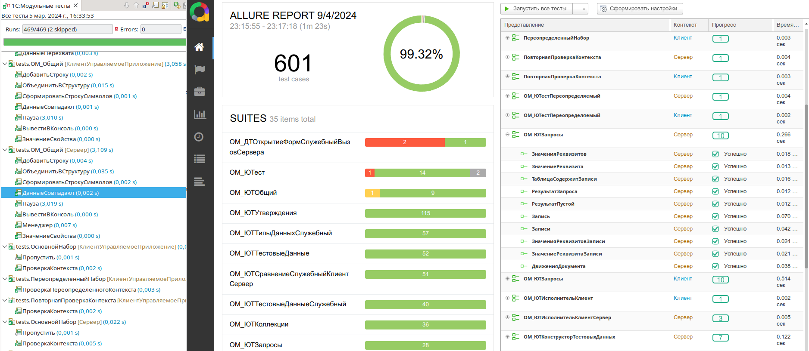

# YAxUnit. Расширение для запуска тестов

----

  

  

  

----

**YAxUnit** представляет собой мощный инструмент написания тестов для решений на платформе 1С:Предприятие.  
Он был создан с учетом лучших практик тестирования и предлагает [множество функций](/docs/features/), которые позволяют эффективно справиться с поставленной задачей.

* Тестовый движок, который выполнит тесты и предоставит подробный отчет в нужном формате.
* [Утверждения](/docs/features/assertions/) для проверки ожидаемых результатов. Они помогают разработчикам ясно и точно определить, какие результаты они ожидают, и автоматически проверить, соответствуют ли реальные результаты этим ожиданиям.
* Мощные инструменты для работы с [тестовыми данными](/docs/features/test-data/). Создание, удаление и поиск нужных данных теперь не проблема.
* Благодаря поддержке [текучих выражений](/docs/getting-started/fluent-api), код тестов становится более читаемым и понятным, что упрощает его поддержку и модификацию.
* Кроме того, YAxUnit предусматривает возможность расширения функциональности, что позволяет разработчикам адаптировать инструмент под свои уникальные требования.
* Последнее, но не менее важное - [плагин для запуска тестов](/docs/getting-started/edt-plugin/) из 1С:Enterprise Development Tools (EDT). Значительно упрощает процесс написания и отладки тестов. В один клик вы может запустить и увидеть результат нужного теста.

Все эти возможности делают YAxUnit мощным помощником разработчика на непростом пути тестирования.

Чтобы более подробнее ознакомиться с возможностями YAxUnit вы можете изучить [документацию](/docs/features), либо [установив](/docs/getting-started/install) все необходимое? попробуйте написать [первый тест](/docs/getting-started/first-test)

## Благодарности

Приносим благодарность всему [open-source сообществу 1с](https://github.com/topics/1c-enterprise) за идеи и мотивацию.

Особая благодарность авторам и контрибьютерам проектов

* [xUnitFor1C](https://github.com/xDrivenDevelopment/xUnitFor1C/graphs/contributors)
* [vanessa-automation](https://github.com/Pr-Mex/vanessa-automation/graphs/contributors)
* [add](https://github.com/vanessa-opensource/add/graphs/contributors)
* [bsl-language-server](https://github.com/1c-syntax/bsl-language-server)
* [bsl_console](https://github.com/salexdv/bsl_console)
* [Любаневич Дмитрию](https://github.com/dlyubanevich) за отзывчивость и компоненту [websocket1c](https://github.com/dlyubanevich/websocket1c)

---

## Лицензия

Copyright © 2025 [BIA-Technologies Limited Liability Company](http://bia-tech.ru/)

Distributed under the [Apache License, Version 2.0](http://www.apache.org/licenses/LICENSE-2.0.html)
